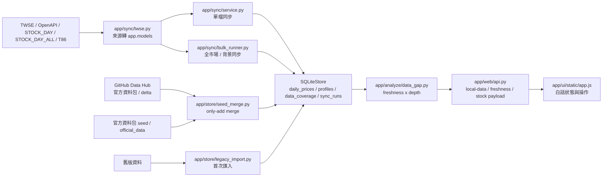
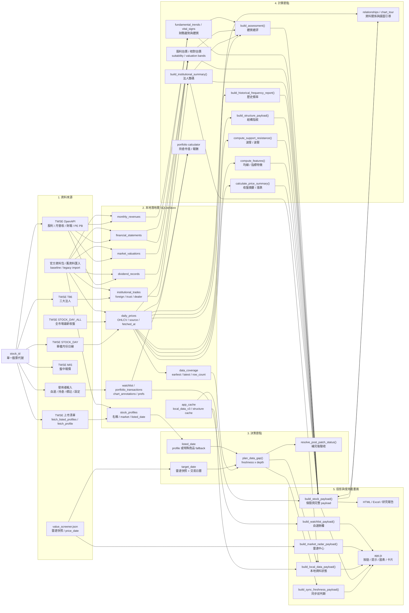
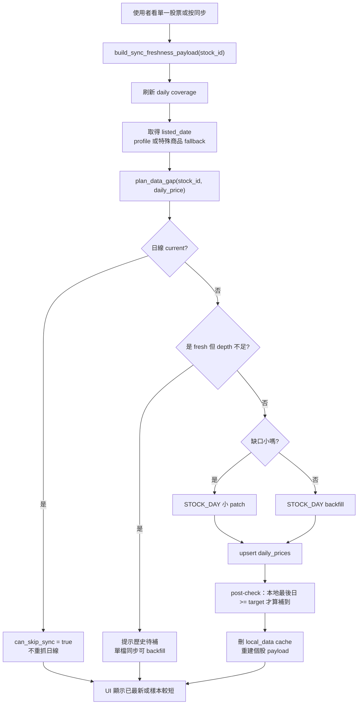

# 00. AGENT 必讀：資訊抓取整合定義

日期：2026-07-06  
目的：任何人或 AI Agent 只要要改「資訊抓取、同步、資料包、本地資料狀態、更新雷達」其中一塊，都要先讀這份。

## 一句話定義

資訊抓取不是單一按鈕，而是一組契約：外部市場來源只由 `app/sync` 接觸；官方 GitHub Data Hub 只作為只讀資料樞紐；資料先進 `SQLiteStore`，所有入口都必須用同一套 freshness x depth 判斷，再由 `app/web/api.py` 投影成使用者看得懂的狀態。

## 先記住四條不可拆規則

1. `app/analyze/data_gap.py` 是日線是否要抓的決策核心，不要在 UI、server 或 bulk 裡另寫一套判斷。
2. 日線狀態永遠分兩軸：freshness 是最新日有沒有到目標日，depth 是近一年歷史夠不夠深。
3. `STOCK_DAY_ALL` 只負責快速補最新收盤，它不能證明歷史完整；歷史深度要靠 `assess_daily_depth()` 推導。
4. 官方資料包只新增公開資料，不覆蓋、不刪除使用者資料；套完一律重算 coverage，不可相信包裡舊的 `data_coverage.status`。
5. GitHub Data Hub 是只讀分發中心：使用者端只能下載、驗證 sha256、only-add merge；一般使用者端永遠不可直接寫入正式 Hub。

## 整體資料流

## 單一股票的資料路徑與計算節點

出發點永遠是 `stock_id`，但它不是一棵單純分類樹，而是一張資料 lineage 圖：來源被抓回來，先落到本地資料表，接著被不同計算節點消費，最後才投影到個股頁、雷達、本地資料頁與報表。

### 單一股票的節點說明

| 節點 | 主要輸入 | 主要輸出 | 注意事項 |
|---|---|---|---|
| 身份節點 | `stock_id`、上市清單 | `stock_profiles`、`listed_date` | `00...` 或含字母商品可能沒有 profile；depth 要 fallback 到本機最早日 |
| 日線節點 | `STOCK_DAY`、`STOCK_DAY_ALL`、官方資料包 | `daily_prices`、`data_coverage` | `STOCK_DAY_ALL` 只能補最新，不能證明歷史完整 |
| 目標日節點 | 雷達快照、交易日曆 | `target_date` | 雷達快照 stale 只能提醒，不等於日線壞掉 |
| gap 決策節點 | coverage、target、listed_date | skip / patch / backfill / pending | 所有入口共用 `plan_data_gap()` |
| 籌碼節點 | T86、institutional table | 法人 summary、chips series | 本地資料頁採市場層級 freshness，不要每檔重抓 |
| 基本面節點 | 股利、估值、營收、財報 | suitability、relative valuation、vital signs | 估價不是只看股利，也會吃財報與最新收盤價 |
| 技術與結構節點 | daily_prices | 摘要、均線、波撐波壓、結構指紋、歷史頻率 | 資料短時要說「樣本短」，不要說同步失敗 |
| 使用者私有節點 | watchlist、portfolio、annotations、prefs | 自選、持倉、圖表標註、偏好 | 官方資料包與更新器永遠不可覆蓋 |
| payload 節點 | store + 計算結果 | `build_stock_payload()` 等 API payload | UI 只吃 payload，不直接碰來源與 schema |

### 單一股票同步的決策骨架

## 入口總覽

| 入口 | 使用者看到的動作 | 真正責任 | 必須共用的契約 |
|---|---|---|---|
| `POST /api/sync` | 個股「同步」 | 補該檔日線與個股資料 | `StockSyncService.sync_stock_history()` 必須呼叫 `plan_data_gap()` |
| `POST /api/bulk-download/start` | 全市場資料下載／補歷史 | 共用檔一次抓，逐檔補日線缺口；帶 `include_history_backfill` 時連續補已最新但歷史不足的 backlog | `bulk_runner.skip()` 和 `sync_one()` 都必須重算 coverage |
| quiet sync | 背景慢慢補 | 低速補最新與少量歷史 | 不阻塞使用者主動操作；排序先補 freshness 小缺口，再補歷史深度不足 |
| `POST /api/bulk-download/retry-failed` | 重試失敗 | 只重試冷卻完成的 failed 項目 | 仍要尊重 failed backoff；全部冷卻中時只回狀態，不啟動 TWSE 請求 |
| `POST /api/value-screener/refresh` | 更新雷達 | 更新快照，不等於補日線歷史 | 雷達快照可做 target 參考，但不可覆蓋日線 truth |
| seed / official data | 套用官方資料包 | 給空庫 baseline | only-add，套完刪 `local_data_v3` cache |
| GitHub Data Hub | 官方資料樞紐 | 先補本機缺口，降低每台電腦直接打 TWSE 的需求 | 只讀、sha256 驗證、only-add merge；失敗就 fallback，不阻塞 |
| legacy import | 首次開啟匯入舊資料 | 非破壞性合併舊 DB | 成功後 dismiss，避免重複詢問 |
| `/api/local-data` | 本地資料狀況 | 把 coverage 轉成人話 | 用 `history_depth` 顯示深度，不直接猜 |

## freshness x depth 的行動矩陣

| 狀態 | depth 夠用或完整 | depth 不足 |
|---|---|---|
| fresh：最新日已到 target | 跳過日線下載 | 一般全市場標 `history_pending`；使用者按「補歷史」或 quiet sync 才回補 |
| stale：只缺少量交易日 | 小缺口 patch | backfill，順便補最新 |
| stale：缺口太大 | force refresh | backfill |
| empty：完全無資料 | 建議先套官方資料包，再補增量 | initial backfill 或套包 |
| source pending | 冷卻後重新檢查，不永久標 done | 冷卻後重新檢查，不永久標 done |

## 目前核心檔案與責任

| 檔案 | 責任 | 改它時一起看 |
|---|---|---|
| `app/analyze/data_gap.py` | `plan_data_gap()`、`assess_daily_depth()`、post-check status | `tests/test_data_gap.py`、`tests/test_bulk_runner.py`、`tests/test_sync_service.py`、`tests/test_web_api.py` |
| `app/sync/twse.py` | TWSE 來源 adapter、retry、throttle、shared cache | `tests/test_twse_adapter.py`、`tests/test_quiet_sync.py` |
| `app/sync/service.py` | 單檔同步與單檔法人同步 | `app/web/server.py` 的 `/api/sync`、`tests/test_sync_service.py` |
| `app/sync/bulk_runner.py` | 全市場下載、quiet sync、T86、top-up、bulk item status | `app/web/sync_batch.py`、`tests/test_bulk_runner.py`、`tests/test_quiet_sync.py` |
| `app/web/api.py` | local-data、stock payload、freshness payload | `app/ui/static/app.js`、`tests/test_web_api.py` |
| `app/web/server.py` | HTTP endpoints、bulk 互斥、seed merge、quiet loop | `tests/test_sync_batch.py`、`tests/test_seed_apply_web.py` |
| `app/store/seed_merge.py` | 官方資料包 only-add merge | `tools/build_seed.py`、`tools/build_official_data_pack.py`、`tests/test_seed_merge.py` |
| `app/update/data_hub.py` | GitHub Data Hub 檢查、下載、解壓與 sha256 驗證 | `app/web/server.py`、`tools/package_data_hub.py`、`tests/test_data_hub.py` |
| `app/ui/static/app.js` | 使用者白話狀態與按鈕路由 | `tests/test_sync_batch.py`、`node --check app/ui/static/app.js` |

## 改 A 時不能忘 B

| 想改的東西 | 必須一起檢查 | 原因 |
|---|---|---|
| 日線是否「已最新」 | `build_sync_freshness_payload()`、`renderPriceWindow()`、`bulk_runner.skip()` | 單檔、UI、全市場要講同一句話 |
| depth 門檻 | 特殊商品 `00...A`、新上市股、停牌股測試 | 不要把短歷史商品誤判成缺一年，也不要讓 top-up-only 變 deep |
| STOCK_DAY 抓取方式 | `TwseClient.fetch_daily_prices()` warning 與 post-check | 單月失敗要可重試，不能把半套資料標 done |
| STOCK_DAY_ALL top-up | `data_gap` depth、bulk on_finish、local-data cache | top-up 只能補最新，不能讓歷史回補失蹤 |
| 全市場 UI 文案 | `BulkDownloadManager.status()`、`bulk_progress`、local-data row labels | 使用者需要知道是「待背景」、「等來源」或「要重試」，且能看到分類樣本與原因 |
| 官方資料包 | seed merge、app-info、強制套用 bat、README | 測試員資料少時要能無痛補資料，但不能覆蓋私人資料 |
| 更新雷達 | `value_screener.json` target date、local-data target | 雷達快照不是 daily_prices，不能當作已同步 |
| TWSE 交通管制 | `_bulk_blocks_twse_fetch()`、`_preempt_quiet_for_user_twse_fetch()` | 手動操作優先；quiet sync 不阻擋使用者，但手動 TWSE 請求進來前要先停 quiet，避免並行限流 |

## 特殊商品規則

`00405A` 這類 `00...` 或含英文字母的商品常有日線，卻沒有一般股票 profile。這時：

- 若 profile 沒有 `listed_date`，可用本機 `earliest_date` 當 depth 起點。
- 日線已到 target 時，短歷史要顯示「樣本較短」，不要顯示「過期」。
- `can_skip_sync` 應由日線是否 current 決定，雷達快照 stale 只能變成提醒，不應強迫重抓日線。

## 使用者白話字典

| 內部狀態 | UI 該說 |
|---|---|
| `current` + `deep/usable` | 日線已最新 |
| `current` + 短商品樣本 | 日線樣本較短，不是同步失敗 |
| `force_refresh_required` + latest >= target | 日線歷史待補，背景會慢慢補 |
| `source_pending` | 來源可能尚未公布，冷卻後自動重新檢查 |
| `failed` + warning | 來源不穩或限流，可排除問題後重試 |
| snapshot stale | 雷達快照待更新，不等於日線壞掉 |

## 施工前檢查清單

1. 先讀本文件，再讀 `docs/18-日線資料同步架構重設計.md`。
2. 找所有入口：`rg "plan_data_gap|build_sync_freshness_payload|build_local_data_payload|bulk-download|seed/apply|STOCK_DAY_ALL" app tests`。
3. 改資料抓取時至少跑：
   - `python -m pytest -q tests/test_data_gap.py tests/test_bulk_runner.py tests/test_sync_service.py tests/test_web_api.py tests/test_twse_adapter.py`
   - `python -m pytest -q`
   - `python -m compileall app`
   - `node --check app/ui/static/app.js`
4. 若變更會影響使用者資料或官方資料包，再跑 `tests/test_seed_merge.py tests/test_seed_apply_web.py tests/test_official_data_pack.py`。
5. 若變更會影響背景同步或互斥，再跑 `tests/test_quiet_sync.py tests/test_sync_batch.py`。

## 不要做的事

- 不要在前端自行判斷日線是否該抓。
- 不要把 `data_coverage.status` 當永遠正確；抓取前要刷新或重算。
- 不要讓全市場下載和單檔同步各走一套補日線邏輯。
- 不要讓官方資料包覆蓋自選股、持倉、標註、設定或使用者私有資料。
- 不要為了讓測試綠而改 `market_calendar` / `twse_calendar` 節假日判斷，除非任務明確要求且有專門測試。
