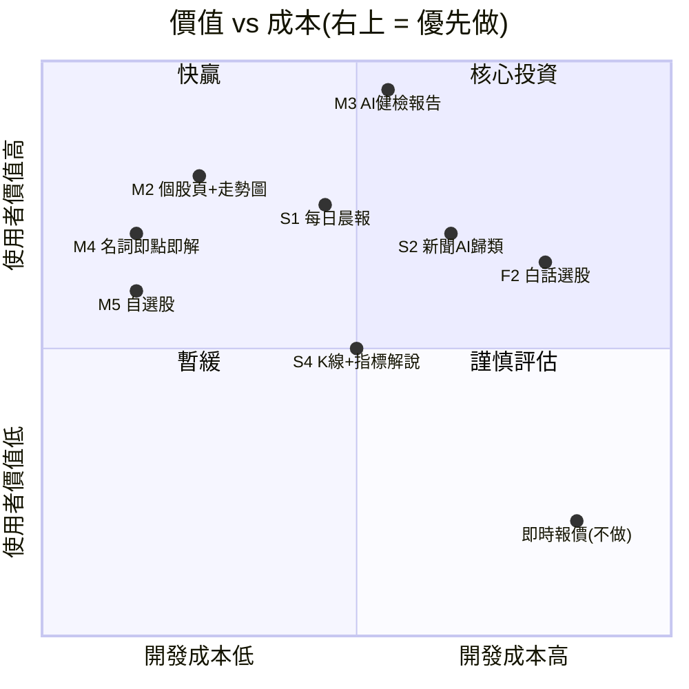

# 02. 功能優先級表

> 分級原則:
> - **MVP**:拿掉任何一項,產品就無法驗證核心假設(「散戶願意用白話健檢報告理解股票」)
> - **第二階段**:MVP 驗證成功後,最能提升留存的功能
> - **未來進階**:有價值但成本高或依賴前面階段的回饋
>
> 每項標註:解決的痛點(對應《01-使用者與痛點》)、開發成本、給 AI Coding Agent 的模組歸屬(對應《04-技術架構》)。

---

## MVP 必須有(目標:2–4 週,一人 + AI Agent)

| # | 功能 | 痛點 | 成本 | 模組 | 驗收標準 |
|---|------|------|------|------|---------|
| M1 | 個股搜尋(代號或名稱) | 入口 | 低 | UI | 輸入「2330」或「台積電」能找到 |
| M2 | 個股總覽頁:近一年收盤價走勢圖 + 基本資料(公司名、產業、股價、漲跌) | P1 | 低 | UI + 資料層 | 任一上市股票可開啟且圖表正確 |
| M3 | **AI 白話健檢報告**(產品核心):4 個維度——①最近趨勢 ②價格位階(目前股價在近年區間的高低位置)③獲利能力(這家公司賺不賺錢)④波動風險。每維度 2–3 句人話 + 結尾免責聲明 | P1, P2 | 中 | 分析層 + AI解說層 | 報告中所有數字都來自本地計算、AI 只負責解讀;離線時顯示上次快取 |
| M4 | 名詞即點即解(tooltip 字典) | P1 | 低 | UI + 字典 | 介面上專業名詞皆可點擊看白話解釋 |
| M5 | 自選股清單(新增/移除/列表顯示今日漲跌) | P5 | 低 | 自選股模組 | 重開程式後清單仍在 |
| M6 | 資料同步:每日收盤後抓台股日線與基本資料 → 存本地資料庫;**離線可看所有已同步資料** | 基礎建設 | 中 | 資料層 | 斷網後重開,M1、M2、M5 與快取的 M3 正常運作 |

**MVP 明確不包含**:K線圖、技術指標、新聞、提醒、筆記、帳號系統、即時報價。

---

## 第二階段(MVP 回饋後,約第 5–10 週)

| # | 功能 | 痛點 | 成本 | 依賴 |
|---|------|------|------|------|
| S1 | 自選股每日摘要(晨報):一頁列出自選股昨日異動 + AI 一句話點評 | P5 | 中 | M3, M5 |
| S2 | 新聞聚合 + AI 摘要歸類(利多/利空/中性 + 理由) | P4 | 中高 | 新增新聞資料源 |
| S3 | 基本面頁:月營收、EPS(每股賺多少錢)、ROE(公司用股東的錢賺錢的效率)等,每個數字附白話解讀 | P2 | 中 | 資料層擴充 |
| S4 | K線圖(顯示每天開盤/收盤/最高/最低價的圖)+ 2–3 個最常用技術指標,**每個都附「現在這個指標在說什麼」的白話解說** | P1 | 中 | M2 |
| S5 | 交易筆記:記錄買賣理由與回顧 | P3, P6 | 低 | 無 |
| S6 | 到價提醒(股價到達設定值時通知) | P3 | 低 | M6 |

---

## 未來進階(第三階段以後,依回饋取捨)

| # | 功能 | 說明 |
|---|------|------|
| F1 | 籌碼面白話化:三大法人(外資、投信、自營商等專業機構)買賣超解讀——「大戶最近在買還是在賣」 |
| F2 | 白話條件選股:「幫我找最近被法人持續買、股價還沒大漲的股票」→ 轉成篩選條件 |
| F3 | 歷史情境回顧:「如果三年前買進這支並持有到今天,結果如何」(教育用途,非預測) |
| F4 | 投資組合健診:整體持股的集中度與風險體檢 |
| F5 | 上櫃/興櫃股票、ETF 支援擴充 |
| F6 | 多裝置同步(才需要帳號系統) |

---

## 永久排除清單

自動下單、券商串接、程式交易、高頻交易(前提排除);股價預測、AI 報明牌、社群聊天室(《01》C 節已論證)。

---

## 優先級總覽圖

