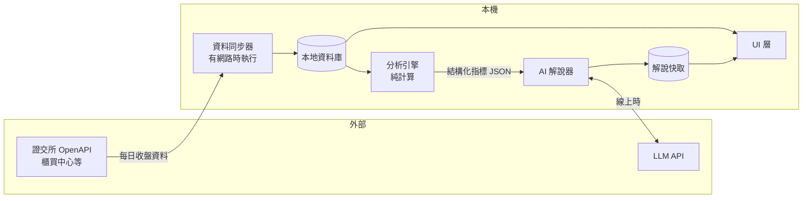
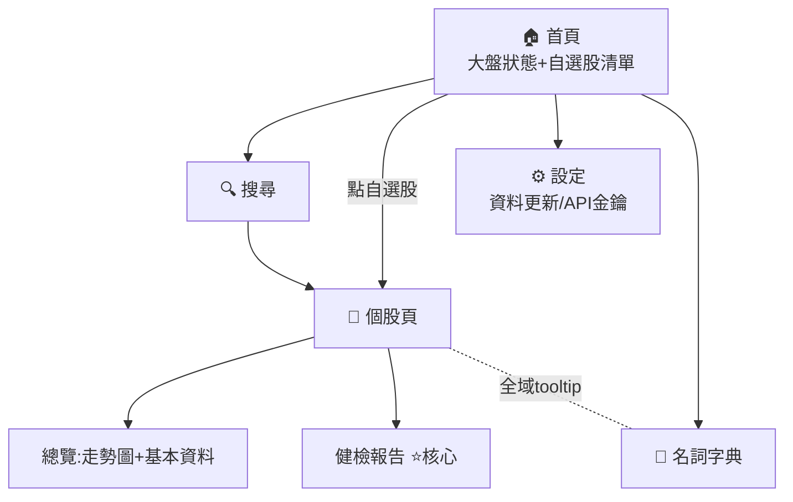
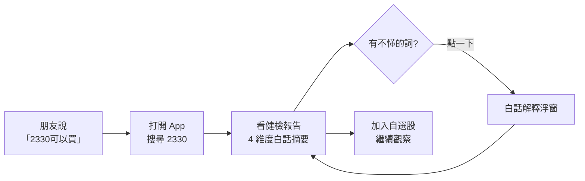

# 03. 產品架構:功能模組、資料流、頁面結構、操作流程

---

## 1. 功能模組

每個模組職責單一、介面明確,AI Coding Agent 可獨立開發與重寫任一模組(技術細節見《04-技術架構》)。

| 模組 | 職責 | MVP? |
|------|------|------|
| **資料同步器** Sync | 從台股公開資料源抓每日資料,寫入本地資料庫。唯一會碰外部股市 API 的模組 | ✅ |
| **資料存取** Store | 本地資料庫的讀寫介面。其他模組只透過它拿資料 | ✅ |
| **分析引擎** Analyze | 純計算:輸入價格序列,輸出指標數據(漲跌幅、區間位置、波動度等)。不碰網路、不碰 AI | ✅ |
| **AI 解說器** Explain | 把分析引擎的結構化結果送給 LLM,產出白話文。含快取(離線顯示上次結果) | ✅ |
| **名詞字典** Glossary | 靜態的術語白話對照表,供全域 tooltip 使用 | ✅ |
| **自選股** Watchlist | 清單的增刪查,存本地 | ✅ |
| **新聞** News | 抓取、儲存、AI 歸類新聞 | 第二階段 |
| **筆記** Journal | 交易筆記的增刪查 | 第二階段 |
| **提醒** Alert | 到價提醒規則與通知 | 第二階段 |

---

## 2. 資料流

核心原則:**UI 永遠只讀本地資料庫,絕不直接呼叫外部 API。** 這是「離線可看」的關鍵——斷網時資料層照常服務,只是內容停在最後一次同步。

離線行為定義:

| 情境 | 行為 |
|------|------|
| 線上 | 同步器更新資料;健檢報告即時生成並寫入快取 |
| 離線 | 走勢圖、自選股、基本資料照常(讀本地);健檢報告顯示快取版 + 標註「產生於 ○月○日」 |
| 首次使用且離線 | 顯示引導:「首次使用需要網路下載資料」 |

---

## 3. 頁面結構(頁面地圖)

MVP 只有 5 個頁面:首頁、搜尋、個股頁(含總覽與健檢兩個分頁)、設定、名詞字典。
第二階段在個股頁加「新聞」「基本面」「K線」分頁,首頁加「今日晨報」區塊——**頁面骨架不變,只長出新分頁**,這是為了讓迭代不必改架構。

---

## 4. 使用者操作流程(核心場景)

### 場景一:驗證明牌(最重要,對應痛點 P2)

設計要求:從搜尋到看完報告 **30 秒內**、**零專業門檻**(每個名詞可點)、報告結尾固定顯示「本內容為資料解讀,不構成投資建議」。

### 場景二:每日例行(對應痛點 P5)

打開 App → 首頁看自選股今日漲跌 → 點異常的(大漲大跌)進個股頁 → 看健檢報告更新。第二階段後此場景升級為「看晨報」。

### 場景三:首次使用

開啟 → 歡迎頁(一句話說明產品)→ 自動下載基礎資料(顯示進度)→ 引導搜尋第一支股票 → 引導加入自選。無註冊、無登入。
