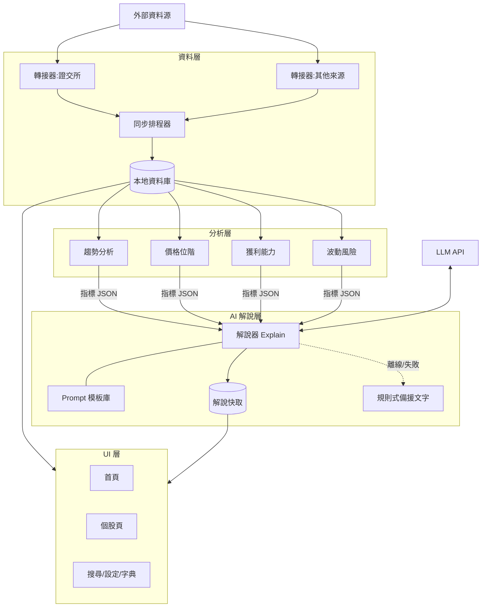

# 04. 技術架構草案(不綁定具體技術)

> 本文描述「層與模組的責任和介面」,不指定程式語言或框架。
> 唯一已定案的架構決策:**本地優先(local-first)**——因為需求明確要求離線可看。

---

## 0. 平台型態決策

需求:同事易試用 + 離線可看。結論:**單機桌面應用,內部採前後端分離**。

理由:離線可看代表資料必須存在使用者機器上(本地資料庫);因此做成「本地引擎(同步+儲存+分析)+ 網頁技術做的 UI」,打包成桌面程式發給同事。具體打包方式(Tauri、Electron、或本地伺服器+瀏覽器開啟)留給開發時依工具熟悉度決定——三者皆相容本架構。未來若要上雲變成網頁服務,只需把「本地引擎」搬上伺服器,UI 幾乎不動。

---

## 1. 四層架構



### L1 資料層

| 元件 | 責任 |
|------|------|
| 來源轉接器 Adapter | 每個外部資料源一個轉接器,負責「抓取 + 轉成統一內部格式」。資料源倒了或改格式,只改一個轉接器 |
| 同步排程器 | 決定何時抓什麼(每日收盤後增量、首次全量)、重試、記錄同步狀態 |
| 本地資料庫 | 單檔關聯式資料庫(如 SQLite 之類)。核心表:股票基本資料、日線價格、自選股、解說快取、同步紀錄 |

統一資料格式範例(所有轉接器的輸出契約):

```json
{ "stock_id": "2330", "date": "2026-06-11", "open": 1050.0, "high": 1062.0,
  "low": 1045.0, "close": 1058.0, "volume": 28541000 }
```

候選資料源(開發第 0 天必須先驗證可用性與使用條款):證交所 OpenAPI(openapi.twse.com.tw,已確認存在、免費)、櫃買中心 OpenAPI、FinMind 等第三方整理源作備援。

### L2 分析層

**純函數**:輸入資料陣列 → 輸出指標 JSON。不碰網路、不碰資料庫、不碰 AI → 可 100% 單元測試,AI Agent 寫的每個指標都能用已知輸入輸出驗證。

每個分析維度一個獨立檔案,輸出統一契約:

```json
{ "metric": "price_position", "value": 0.82, "window": "52w",
  "inputs_summary": { "high_52w": 1100, "low_52w": 750, "close": 1058 } }
```

### L3 AI 解說層

責任:把分析層的 JSON 翻譯成白話。三條鐵則:

1. **AI 不算數字。** 所有數字由分析層計算,Prompt 中明令「只能使用提供的數據,不得自行推算或預測」→ 防 AI 幻覺。
2. **AI 不給建議。** Prompt 模板強制輸出為「描述 + 一般解讀方式」,禁止「建議買進/賣出」字眼,輸出後再用關鍵字檢查一層(防投顧法規風險,見《06-風險》)。
3. **永遠有東西可顯示。** 解說結果寫入快取;離線或 API 失敗時退回快取,連快取都沒有時退回規則式模板文字(例如「股價位於 52 週區間的高位(82%)」這種由程式拼的句子)。

Prompt 模板獨立成檔案管理(不寫死在程式碼中),調整語氣不需動程式。

### L4 UI 層

只讀本地資料庫與解說快取。元件對應頁面結構(《03》),全域 tooltip 元件掛接名詞字典。

---

## 2. 給 AI Coding Agent 的開發規範

| 規範 | 內容 |
|------|------|
| 模組邊界 | 跨模組只能呼叫公開介面,禁止跨模組讀內部實作。介面契約(上述 JSON)變更需先改文件 |
| 可驗證性 | 分析層:單元測試(固定輸入→固定輸出)。資料層:用錄製的 API 回應做測試,不打真 API。解說層:測「fallback 鏈」與「禁止字眼檢查」,不測 LLM 文字內容 |
| 局部重做 | 任一模組重寫時,只要通過該模組的契約測試即可合併 |
| 目錄即模組 | 一個模組一個目錄,目錄內含 README(責任、介面、測試方式)|
| 反模式 | 禁止:UI 直連外部 API、分析層夾帶 AI 呼叫、共用「上帝物件」 |

建議的程式目錄骨架(語言無關):

```
app/
  sync/        # L1 同步器與轉接器
  store/       # L1 資料庫存取
  analyze/     # L2 各分析維度(一檔一指標)
  explain/     # L3 解說器、prompts/、fallback
  glossary/    # 名詞字典(資料檔 + 查詢)
  watchlist/   # 自選股
  ui/          # L4 頁面與元件
  tests/       # 各模組契約測試
```
