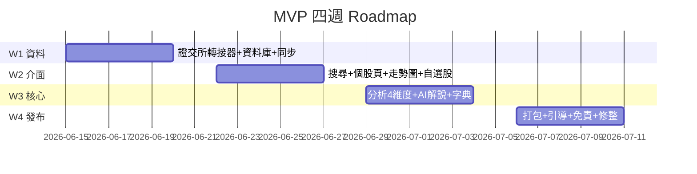

# 05. 最小可行版本(MVP)與開發 Roadmap

---

## 1. 一人開發者的「20% 功能」

MVP 要驗證的唯一假設:**「散戶會用白話健檢報告來理解一支股票,並覺得『終於看懂了』。」**
其他一切(留存、晨報、筆記)都建立在這個假設成立之上,所以 20% 的功能就是讓人能完整跑一次「搜尋 → 看懂 → 收藏」:

1. 搜尋一支台股(M1)
2. 看到走勢圖與基本資料(M2)
3. 看到 AI 白話健檢報告,不懂的詞點得開(M3 + M4)⭐ 核心
4. 加入自選股,明天打開還在、資料有更新(M5 + M6)

**砍到不能再砍的證明**:再砍 M4 → 報告裡的名詞看不懂,核心假設測不出來;再砍 M5 → 同事用一次就沒有回來的理由,收不到第二次回饋;再砍 M6 → 每次展示都要現抓資料,斷網就掛。所以這就是最小集合。

---

## 2. 四週開發計畫(一人 + AI Coding Agent)

| 週 | 目標 | 交付物 | 驗證方式 |
|----|------|--------|---------|
| **W1** | 資料打通 | 證交所轉接器 + 本地資料庫 + 同步器;命令列可查任一股票近一年日線 | 抽 10 支股票與證交所網站比對數字 |
| **W2** | 看得到 | UI 骨架:搜尋、個股頁(走勢圖+基本資料)、自選股 | 同事能自己搜到股票並看圖 |
| **W3** | 看得懂 ⭐ | 分析層 4 維度 + AI 解說器(含快取與備援)+ 名詞 tooltip | 找 1–2 位完全不懂股票的同事讀報告,問「你看懂了嗎?」 |
| **W4** | 發得出去 | 打包成可安裝程式、首次使用引導、免責聲明、修 bug | 3–5 位同事在自己電腦安裝,收集回饋表 |

每週五為「可展示日」:當週成果必須能 demo,做不完就砍範圍、不延期。

---

## 3. MVP 之後的 Roadmap

| 階段 | 期間(約) | 內容 | 進入條件 |
|------|-----------|------|---------|
| 迭代一 | W5–W7 | 依回饋修核心體驗;加晨報(S1)、交易筆記(S5) | MVP 回饋中「看懂率」過半 |
| 迭代二 | W8–W10 | 新聞 AI 歸類(S2)、基本面頁(S3) | 晨報有人每天開 |
| 迭代三 | W11+ | K線+指標白話解說(S4)、到價提醒(S6) | 使用者主動要求進階圖表 |
| 第三階段 | 視回饋 | 籌碼白話化(F1)、白話選股(F2)等 | 前述功能留存穩定 |

原則:**每個階段的進入條件都是上一階段的使用證據,不是時間到了就做。** 沒人用晨報就不該做新聞歸類,而是回頭修健檢報告。

---

## 4. MVP 回饋收集設計

給同事的回饋表只問四題:① 你看懂健檢報告了嗎?哪句看不懂?② 你會想用它查朋友報的明牌嗎?③ 最想要它多做什麼?④ 哪個功能你完全沒用到?
第④ 題用來砍功能——MVP 的目的除了驗證要做什麼,同樣重要的是證明什麼不用做。
