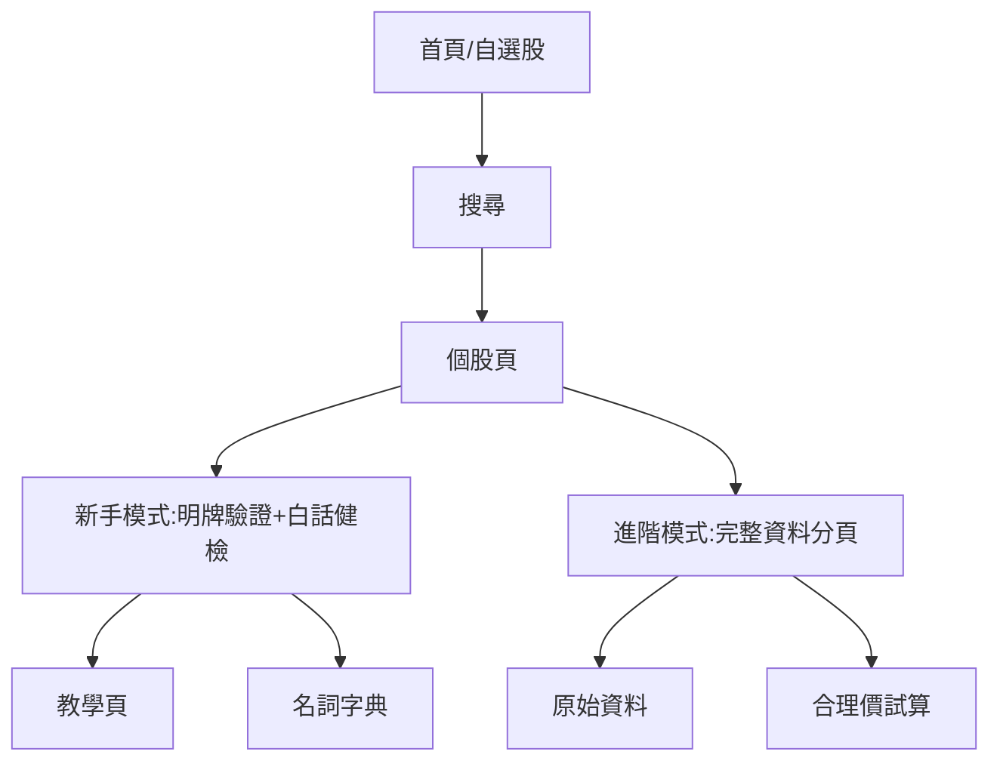

# 07. 雙模式產品藍圖:新手看懂、老手夠用

> 本文把「股票翻譯機」重新定位成雙層產品:
> 第一層是答案優先的新手模式;第二層是資料完整的進階模式。
> 目標不是少資料,而是讓資料有入口、有翻譯、有層次。

---

## 0. 朋友截圖代表的真需求

朋友目前期待的資訊量不是一張走勢圖,而是一整套個股資料庫:

### 分類入口

- 籌碼面
- 消息面
- 基本面
- 每月營收

### 股利與股價歷史

- 歷年殖利率
- 歷年股利
- 歷年股價
- 歷年填權息
- 股利發放率

### 基本面歷史

- 歷年 EPS
- 歷年 ROE
- 歷年 ROA
- 歷年淨利
- 歷年毛利
- 歷年營益
- 歷年營收
- 業外損益

### 估價試算

- 合理價
- 便宜價
- 昂貴價
- 試算年數
- 是否把股票股利納入計算
- 近 5 年現金股利與股票股利

結論:老手不是只要「看懂」,他要「能驗證」。新手需要答案;老手需要展開後的資料證據。

---

## A. 使用者類型與需求差異

| 類型 | 典型問題 | 需要什麼 | 不適合直接給什麼 |
|------|----------|----------|------------------|
| 完全新手 | 這支股票到底在幹嘛?現在看起來危不危險? | 三句白話、名詞解釋、下一步該看哪裡 | 一進頁面就塞 EPS/ROE/KD/MACD |
| 一般散戶 | 朋友說這支可以看,我想驗證一下 | 明牌驗證工作台、自選股、價格位階、基本面摘要 | 秒級報價、複雜技術指標 |
| 長期存股族 | 這家公司配息穩不穩?殖利率合理嗎? | 股利歷史、殖利率、股利發放率、填權息、合理價試算 | 短線 KD/RSI 當主畫面 |
| 價值投資者 | 公司賺錢能力、成長性、估值是否合理? | EPS/ROE/ROA、營收、毛利、營益、淨利、本益比、估價區間 | 只看近期漲跌 |
| 技術分析派 | 現在趨勢、支撐壓力、短線過熱嗎? | K 線、均線、RSI、MACD、成交量、籌碼變化 | 只有年報資料 |
| 老手資料查詢者 | 我要快速看完整資料,自己判斷 | 高密度資料表、分頁、匯出、完整歷年資料 | 過度教學或強迫閱讀白話說明 |

產品要同時滿足兩種核心心理:

1. 新手:不要讓我怕,先告訴我這代表什麼。
2. 老手:不要擋我,讓我快速看到完整資料。

---

## B. 新手模式與進階模式資訊架構

### 新手模式:答案優先

新手模式的順序:

1. 明牌驗證工作台
2. 白話健檢報告
3. 名詞即點即解
4. 一張最必要的走勢圖
5. 加入自選股
6. 下一步學習卡

新手模式每一區都必須回答:

- 這是好還壞?
- 為什麼?
- 我還缺哪個資料不能下判斷?
- 這不是買賣建議。

### 進階模式:資料完整

進階模式的順序:

1. 總覽
2. 籌碼面
3. 消息面
4. 基本面
5. 每月營收
6. 股利/殖利率
7. 估價試算
8. 技術面
9. 原始資料

進階模式不是取消白話,而是每個資料表上方保留一句「這張表看什麼」。

---

## C. 產品頁面重新規劃

| 頁面 | 新手模式 | 進階模式 |
|------|----------|----------|
| 首頁 | 自選股 + 今日異動白話摘要 + 待補資料提醒 | 自選股表格、漲跌、殖利率、估值狀態 |
| 搜尋 | 輸入代號或名稱,找股票 | 支援多股票比較與篩選 |
| 個股頁 | 明牌驗證工作台、白話健檢、走勢圖、自選 | 全部分頁與歷年資料 |
| 教學頁 | 投資基礎課程、術語卡、情境教學 | 進階章節、資料判讀案例 |
| 名詞字典 | 點詞查解釋 | 可搜尋、分類、連到實際範例 |
| 自選股 | 關注清單 + 為什麼加入 | 分群、排序、估值狀態 |
| 資料來源頁 | 告訴新手資料更新時間 | 顯示資料源、欄位、更新紀錄 |
| 設定頁 | API 金鑰、資料同步 | 匯出、資料庫管理 |

---

## D. 個股頁三層資訊設計

### 第一層:30 秒看懂

預設顯示:

- 股票名稱與代號
- 加入/移除自選
- 明牌驗證工作台三句:
  - 最近趨勢
  - 價格位階
  - 還缺什麼資料
- 最新收盤、單日變化、一年位置、本地筆數
- 免責聲明

第一層不顯示:

- 完整財報表
- 一堆指標縮寫
- 技術指標細節
- 合理價公式

### 第二層:白話健檢

預設顯示卡片:

- 趨勢
- 價格位階
- 獲利能力
- 波動風險
- 股利穩定性
- 估值區間

每張卡片格式:

1. 一句答案
2. 2 到 3 個關鍵數字
3. 這代表什麼
4. 可展開看原始資料

### 第三層:完整資料

以分頁或抽屜顯示:

- 籌碼面
- 消息面
- 基本面
- 每月營收
- 股利與殖利率
- 合理價試算
- 技術面
- 原始資料

第三層預設隱藏,但老手可以一鍵切換為「進階模式」後常駐。

---

## E. 新手教學系統

教學不應該是獨立課本,而是融入使用流程。

### 教學內容

| 模組 | 主題 |
|------|------|
| 投資基礎 | 股票是什麼、股價為什麼會動、配息是什麼、風險是什麼 |
| 股票名詞 | EPS、ROE、ROA、本益比、殖利率、成交量、除權息 |
| 基本面 | 營收、毛利、營益、淨利、業外損益、ROE/ROA |
| 技術面 | K 線、均線、RSI、MACD、KD、成交量 |
| 籌碼面 | 三大法人、外資、投信、自營商、買超賣超 |
| 估價 | 合理價、便宜價、昂貴價、殖利率估價、本益比估價 |

### 融入方式

- 名詞即點即解:看到詞就能點。
- 卡片底部「想知道為什麼?」連到教學。
- 個股頁根據缺口推薦學習:例如看到「獲利能力待補資料」,推薦 EPS/ROE 課程。
- 教學頁使用真股票資料做範例,不要只寫抽象定義。
- 完成一個教學後,回到個股頁看同一個指標。

---

## F. 功能分級

### MVP 必須有

- 搜尋股票
- 同步台股日線與基本資料
- 本地 SQLite 離線可看
- 明牌驗證工作台
- 白話健檢報告
- 名詞即點即解
- 自選股
- 近一年收盤價圖
- 最近資料表
- 基本免責聲明

### 第二階段

- 每月營收
- EPS/ROE/ROA
- 營收、毛利、營益、淨利
- 股利、殖利率、股利發放率
- 合理價/便宜價/昂貴價試算
- 進階模式分頁
- 教學頁第一版

### 第三階段

- 籌碼面
- 消息面
- 歷年填權息
- 技術面:K 線、均線、RSI、MACD、KD
- 多股比較
- 自選股晨報
- 筆記與買入理由

### 永久不做

- 自動下單
- 券商串接
- 程式交易
- 高頻交易
- AI 報明牌
- AI 預測股價
- 未加警語的買賣建議

---

## G. 完整產品藍圖

產品一句話:

**股票翻譯機:先把股票講成人話,再讓需要的人展開完整資料。**

核心原則:

1. 答案優先,資料佐證。
2. 新手預設看白話,老手一鍵看資料。
3. 每個指標都能點開解釋。
4. 所有數字都可追溯資料源。
5. AI 只解釋,不算數字,不預測,不建議買賣。

產品結構:

---

## I. 雙視角批判

### 完全新手視角

最大風險:

- 看到太多「歷年」和指標縮寫會直接放棄。
- 合理價、便宜價、昂貴價可能被誤認為買賣指令。
- 名詞解釋如果太長,仍然看不懂。
- 「資料不足」太多會覺得產品沒用。

對策:

- 第一層永遠只給三句重點。
- 估價區間必須寫成「估算參考」而不是答案。
- 每個教學只解一件事。
- 缺資料時要說下一步:例如「還不能看獲利能力,下一版會接 EPS/ROE」。

### 老手視角

最大風險:

- 覺得白話卡太慢、太淺。
- 找不到完整資料表。
- 沒有股利、EPS、ROE、營收、合理價就不會留下。
- 資料源更新慢或欄位不可信會直接失去信任。

對策:

- 明確提供進階模式。
- 個股頁保留完整資料入口,不要藏太深。
- 第二階段優先補股利、營收、EPS/ROE/ROA、估價試算。
- 每個數字標示資料日期與來源。

---

## 本文結論

朋友截圖不是要我們把首頁變成一堆藍色按鈕,而是提醒:

**要贏老手,資料深度不能缺;要贏新手,第一眼不能是資料庫。**

因此正確產品形狀是:

**新手模式負責翻譯,進階模式負責完整。**

