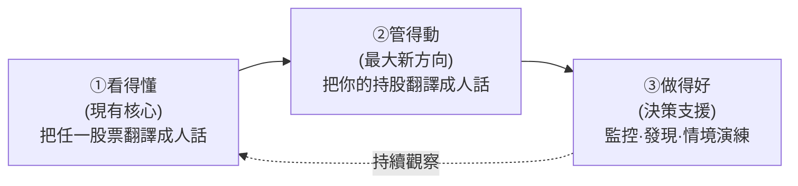
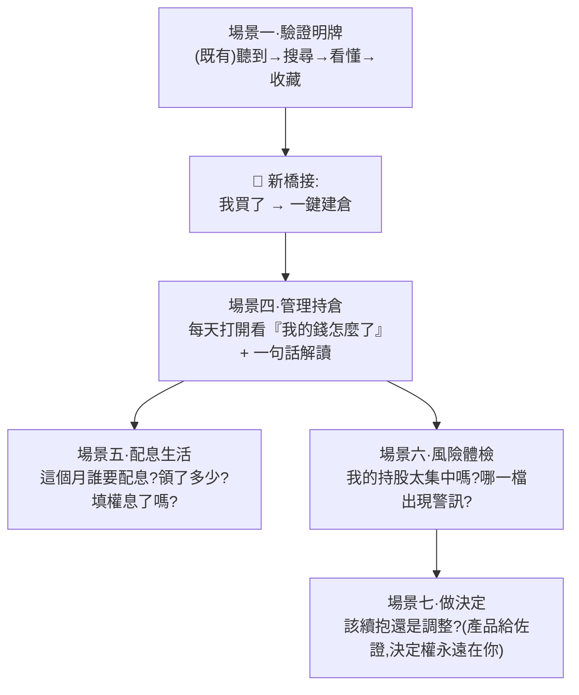
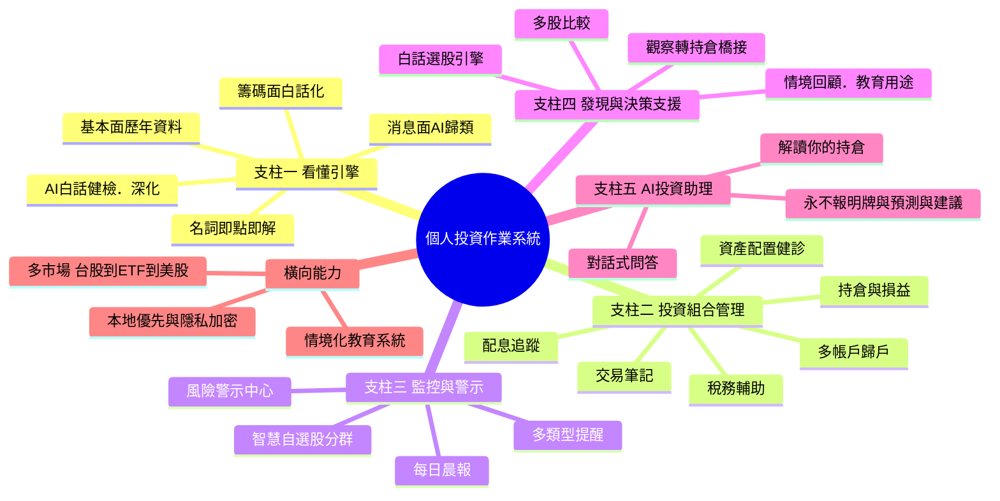
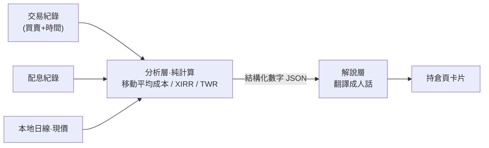
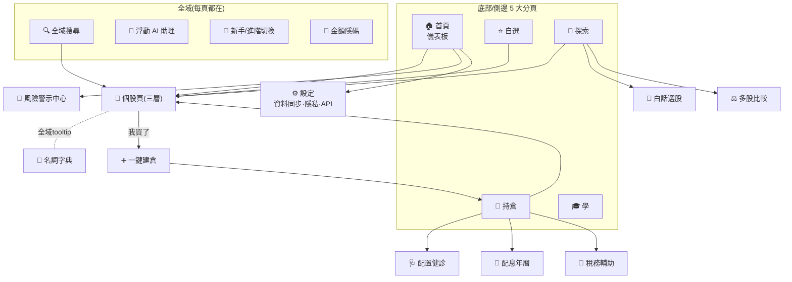
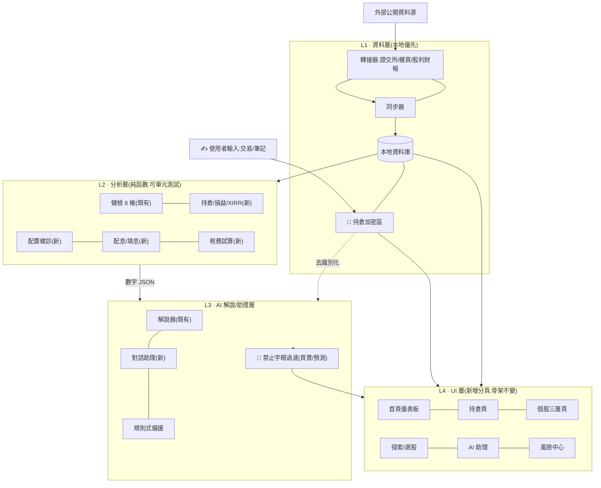
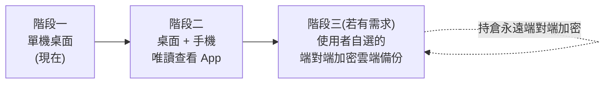
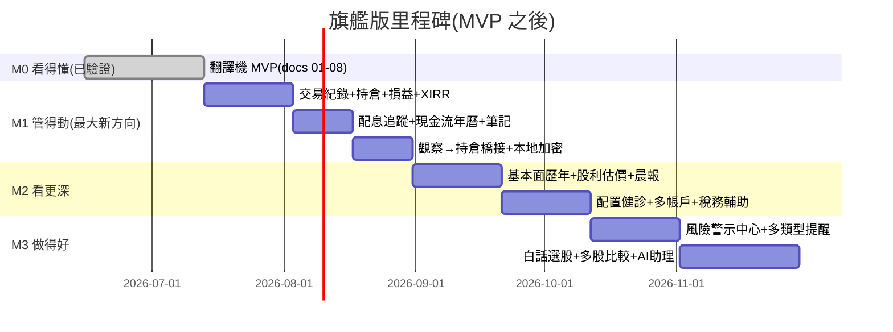

# 09. 旗艦前導書：從「股票翻譯機」到「個人投資作業系統」

> **這是一份開創方向的前導書(Vision / Prelude),不是施工文件。**
> 它把現有的「股票翻譯機」(看懂) 往上長出兩個新層次:**管得動**(投資組合管理) 與 **做得好**(發現與決策支援),
> 目標是成為散戶的「個人投資作業系統 (Personal Investing OS)」。
>
> 台股優先 · 本地優先(離線可看 · 持倉不上傳)· **永遠不下單、不串券商交易、不報明牌、不預測股價、不給買賣建議**。
>
> 本文與既有 docs 的關係:**不取代,是上層願景。** 《01–08》定義了已驗證的核心(翻譯機 MVP);本文定義核心成立後,產品要往哪裡長、長成什麼形狀。所有新功能仍須通過《06》的紀律檢驗。

---

## 目錄

- **0.** TL;DR — 一頁讀完
- **1.** 定位升級:翻譯機 → 投資作業系統
- **2.** 為什麼是現在:機會與缺口
- **3.** 使用者升級:從雙模式到全光譜
- **4.** 開創方向:五大支柱
- **5.** 核心新方向:投資組合管理(深入設計)⭐
- **6.** 完整功能總藍圖
- **7.** 介面設計與視覺化原型 ⭐
- **8.** 資料與技術架構升級
- **9.** 商業模式與永續
- **10.** Roadmap:邁向旗艦
- **11.** 風險與過度設計(旗艦版新增)
- **12.** 成功指標
- **13.** 給 AI Coding Agent 的下一步
- **附錄.** 旗艦版新增名詞

---

## 0. TL;DR 一頁讀完

| 面向 | 結論 |
|------|------|
| 升級後一句話 | **股票翻譯機 → 個人投資作業系統:把市場「看懂」、把持股「管動」、把決策「做好」,全程說人話。** |
| 三個動詞 | **看得懂**(現有核心,深化)→ **管得動**(投資組合管理,最大新方向)→ **做得好**(發現、監控、決策支援) |
| 最大開創方向 | **投資組合管理**:持倉、成本、已/未實現損益、配息追蹤、資產配置健診、多帳戶歸戶、稅務輔助、報酬率(XIRR)與大盤對比 |
| 一句話差異化 | 市面 App 比「資料多、能下單」;本產品比「**你完全看得懂自己的錢在發生什麼事**」。連你的整個投資組合都翻譯成人話。 |
| 守住的靈魂 | 白話優先、名詞即點即解、答案先給佐證隨後、AI 只解讀不算數字、本地優先離線可看 |
| 永久紅線(擴充) | 不下單、不串券商交易、不報明牌、不預測股價、不給買賣建議;**(新增)持倉是高度敏感個資 → 本地加密、絕不上傳、可一鍵清除** |
| 介面主軸 | 5 大分頁(首頁儀表板 / 持倉 / 自選 / 探索 / 學) + 全域搜尋 + 浮動 AI 助理 + 新手/進階雙模式切換 |
| 架構 | 沿用模組化單體四層(資料/分析/解說/UI),**新增持倉、配息、稅務、警示、新聞、籌碼、選股、助理、教育 9 個模組**,介面即契約、本地優先不變 |
| 商業模式 | 免費核心(翻譯機 + 基礎持倉)+ Pro 訂閱(多帳戶、進階健診、稅務、AI 助理額度);**絕不靠賣明牌或賣使用者資料獲利** |

**產品北極星 (North Star):** 每週主動打開、看完、且「因為看懂而更安心地做了一個決定(買/賣/續抱/不動)」的使用者數。不是停留時間,不是刷新次數——那是焦慮,不是價值。

---

## 1. 定位升級:翻譯機 → 投資作業系統

### 1.1 三個動詞,三個層次

現有產品只做第一個動詞。旗艦版把它長成完整的閉環:



| 層次 | 動詞 | 回答使用者的問題 | 對應功能群 | 來源 |
|------|------|------------------|------------|------|
| L1 | **看得懂** | 「這支股票到底好不好、貴不貴、危不危險?」 | AI 白話健檢、名詞即點即解、籌碼/消息/基本面白話化 | 既有 MVP + 深化 |
| L2 | **管得動** | 「我手上的錢現在發生什麼事?賺賠多少?風險集中在哪?配息何時來?」 | 投資組合管理、配息追蹤、配置健診、交易筆記 | ⭐ 全新 |
| L3 | **做得好** | 「我該注意什麼?有沒有符合我條件的股票?如果當初這樣做會怎樣?」 | 智慧監控與警示、白話選股、多股比較、情境回顧、AI 助理 | 部分來自既有 F1–F4,大幅擴充 |

### 1.2 為什麼這個升級是自然的、而不是范圍蔓延

《06-風險》最大的紀律是「砍范圍」。投資組合管理乍看像是違反紀律的「大功能」,但它其實是**同一個產品靈魂的延伸**:

- 翻譯機的本質是「把市場資料翻譯成人話」。
- 投資組合管理的本質是「把**你自己的**資料(持倉、損益、配息)翻譯成人話」。
- 兩者用的是同一套白話引擎、同一套名詞字典、同一條「AI 只解讀不建議」的紅線。

> 換句話說:旗艦版不是「翻譯機 + 一個記帳 App」,而是「**把翻譯的對象從『別人的股票』擴大到『你自己的整個投資組合』**」。這讓 P3(不知何時該賣)、P5(資訊分散)、P6(沒紀錄無法學習)第一次有了真正的解法——因為產品終於知道你「持有什麼、用多少成本買的、為什麼買」。

### 1.3 升級後的一句話

> **看得懂任何一支股票,管得動自己的每一筆持股,在不被報明牌的前提下把決策做得更踏實——而且全程說人話。**

---

## 2. 為什麼是現在:機會與缺口

| 觀察 | 說明 | 對產品的意義 |
|------|------|--------------|
| 市場兩極 | 一端是券商 App(能下單、但介面像駕駛艙、假設你已懂);另一端是記帳/試算表(能管錢、但不解讀、要自己懂) | **中間沒有人做「看得懂 + 管得動」的合體**,這就是缺口 |
| 散戶痛點未解 | 《01》的 P3(不知何時賣)、P6(沒紀錄)在 MVP 階段「碰不到」,因為產品不知道你持有什麼 | 投資組合管理是解開 P3/P6 的**唯一鑰匙** |
| AI 成熟 | LLM 已能穩定做「結構化資料 → 白話解讀」,且成本逐年下降 | AI 助理可以從「逐頁解說」進化成「對話式問答」,且能解讀你自己的持倉 |
| 資料可得 | 證交所/櫃買 OpenAPI、官方股利與財報資料免費且穩定(《04》已驗證) | 持倉所需的「現價、配息、財報」資料都已在既有資料層射程內 |
| 隱私意識抬頭 | 使用者越來越在意「我的持股會不會被拿去賣」 | **本地優先 + 持倉不上傳**從限制變成賣點:你的錢的秘密,只留在你的電腦 |

---

## 3. 使用者升級:從雙模式到全光譜

《07》定義了「新手 / 進階」雙模式與 6 種使用者類型。旗艦版保留雙模式作為**呈現層的開關**,但在功能層用「**待完成的工作 (Jobs To Be Done)**」重新組織,因為同一個人會在不同時刻是不同類型。

### 3.1 六種使用者 × 旗艦版新增價值

| 使用者類型 | 既有價值(看得懂) | 旗艦新增價值(管得動 + 做得好) |
|------------|-------------------|--------------------------------|
| 完全新手 | 三句白話、名詞解釋 | 第一次買進後,用「持倉健檢」看懂自己的部位;配息日曆帶來成就感 |
| 一般散戶 | 明牌驗證工作台 | 把「驗證過的明牌」一鍵從觀察轉成持倉,後續自動追蹤損益與異動 |
| 長期存股族 | 股利歷史、殖利率 | **配息追蹤 + 填權息進度 + 實際成本殖利率 + 股利現金流年曆**——這是存股族的主畫面 |
| 價值投資者 | EPS/ROE、估價區間 | 投資組合的加權估值狀態、買進均價 vs 合理價、再平衡提示 |
| 技術分析派 | K 線、均線、RSI/MACD | 持股的技術訊號警示(跌破季線、量價背離)集中到風險中心 |
| 老手資料查詢者 | 高密度資料表、匯出 | 多帳戶歸戶、XIRR、與大盤/同業對比、完整交易與配息歷史匯出 |

### 3.2 旗艦版的核心使用場景(在既有三場景上新增)



> **設計鐵則(延續《01》觀察 2):** 旗艦版依然**拒絕強化盤中焦慮刷新**。所有「管得動」功能都以「收盤後 / 每日一次」的節奏呈現,主打「踏實感」而非「即時刺激」。沒有秒級紅綠跳動、沒有盤中推播轟炸。

---

## 4. 開創方向:五大支柱

旗艦版的功能用五大支柱組織。每支柱標註:對應痛點(《01》)、與既有 MVP 的關係、紅線。



### 支柱一 · 看懂引擎(深化既有核心)

| 功能 | 說明 | 痛點 | 狀態 |
|------|------|------|------|
| AI 白話健檢報告 | 4 維度(趨勢/位階/獲利/波動)→ 擴充股利穩定性、估值區間共 6 維度 | P1,P2 | 既有 → 深化 |
| 名詞即點即解 | 全域 tooltip,連到情境化教學 | P1 | 既有 |
| 籌碼面白話化 | 三大法人買賣超 →「大戶最近在買還是在賣」 | P1,P2 | F1 → 升級 |
| 消息面 AI 歸類 | 新聞標利多/利空/中性 + 理由 + 屬於營運/產業/情緒 | P4 | S2 → 升級 |
| 基本面歷年資料 | EPS/ROE/ROA/營收/毛利/營益/淨利/業外,每筆附白話 | P2 | S3 → 升級 |

> 紅線:AI 不算數字、不給建議,所有數字可追溯資料源與日期。

### 支柱二 · 投資組合管理 ⭐(最大新方向,詳見第 5 章)

| 功能 | 一句話 | 痛點 |
|------|--------|------|
| 持倉與損益 | 我持有什麼、成本多少、現在賺賠多少(已實現/未實現) | P3,P5 |
| 配息追蹤 | 誰要配息、配了多少、填權息了嗎、實際成本殖利率多少 | P5 |
| 資產配置健診 | 我的錢太集中在某產業/某股/股票嗎?風險體檢 | P3 |
| 多帳戶歸戶 | 好幾個券商帳戶的持股,合併成一個總覽 | P5 |
| 稅務輔助 | 股利所得、二代健保補充保費、交易成本一年統計 | P5 |
| 交易筆記 | 買進時記一句理由,賣出時回顧——建立決策依據 | P3,P6 |

> 紅線:**只記錄與解讀,不下單、不串券商交易。持倉資料本地加密、絕不上傳。**

### 支柱三 · 監控與警示

| 功能 | 一句話 | 痛點 |
|------|--------|------|
| 智慧自選股 | 分群(觀察中/考慮買/存股池)、記錄「為什麼加入」 | P5 |
| 每日晨報 | 一頁看完自選 + 持倉昨日異動 + AI 一句話點評 | P5 |
| 多類型提醒 | 到價、單日異動、營收公布、配息日、法人連續買賣超 | P3 |
| 風險警示中心 | 把持股出現的訊號集中:跌破均線、營收衰退、配息中斷、過度集中 | P3 |

> 紅線:提醒只描述「發生了什麼」,不說「所以你該買/賣」。

### 支柱四 · 發現與決策支援

| 功能 | 一句話 | 痛點 |
|------|--------|------|
| 白話選股引擎 | 「幫我找最近被法人買、殖利率 >4%、還沒大漲的股票」→ 轉成篩選條件 | P2 |
| 多股比較 | 2–4 支並排比 6 維度健檢與歷年數據 | P2 |
| 情境回顧 | 「如果三年前買並抱到今天會如何」——教育用途,標明非預測 | P6 |
| 觀察 → 持倉橋接 | 驗證完的明牌一鍵轉持倉;賣出後自動回顧當初理由 | P3,P6 |

> 紅線:選股是「篩資料」不是「報明牌」;情境回顧固定標註「歷史不代表未來」。

### 支柱五 · AI 投資助理

| 功能 | 一句話 | 痛點 |
|------|--------|------|
| 對話式問答 | 「台積電最近為什麼跌」「我的持股風險在哪」用問的就能查 | P1,P5 |
| 解讀你的持倉 | 基於你本地的持倉資料,生成個人化白話解讀(資料不出本機送 LLM 前去識別化) | P3 |
| 引導下一步 | 「你想看懂哪個面向?」帶你到對應頁面與教學 | P1 |

> 紅線(最嚴):助理**永不**輸出「建議買/賣」「會漲/會跌」「目標價」;輸出後經關鍵字過濾(延續《04》解說層三鐵則),且固定附免責。

### 橫向能力

- **情境化教育系統**:教學融入流程(看到缺口→推薦課程),用真股票資料當範例(延續《07》E 節)。
- **多市場擴充**:轉接器模式天然支援。順序:台股上市 → ETF → 上櫃/興櫃 → (視回饋)美股。**介面留著、實作逐步補**(守《06》O6,不過早抽象)。
- **本地優先與隱私加密**:持倉是高度敏感個資,旗艦版把它列為**第一級紅線**(詳見 5.7)。

---

## 5. 核心新方向:投資組合管理(深入設計)

> 這是旗艦版最大的開創方向,也是把產品從「工具」變成「每天都要打開的作業系統」的關鍵。
> 本章把它拆成:資料模型 → 損益與報酬 → 配息追蹤 → 配置健診 → 多帳戶 → 稅務輔助 → 隱私紅線。

### 5.1 設計哲學:它是「持倉的翻譯機」,不是記帳軟體

市面上的記帳/試算工具只給你數字(成本、現值、報酬率),你還是得自己解讀。本產品的差異化:**每一個數字旁邊都有一句白話。**

| 一般記帳工具給你 | 本產品額外給你(白話翻譯) |
|------------------|----------------------------|
| 未實現損益 -12% | 「這檔目前帳面虧 12%,主要發生在上個月跌破季線之後;你當初買進的理由是『等 AI 訂單』,那個理由還在嗎?」 |
| 殖利率 5.2% | 「以你的**買進成本**算,實際殖利率 5.2%,比現在市價殖利率 4.1% 高,因為你買在相對低點」 |
| 持股 8 檔 | 「你的錢有 63% 集中在半導體一個產業,單一產業超過六成,波動會比較大」 |

### 5.2 資料模型(核心新增資料域)

投資組合管理需要在既有資料層(股票基本資料、日線、自選)之上,新增四張核心表。延續《04》「介面即契約」,以下為內部統一格式範例:

```
交易紀錄 transactions(一筆買賣)
{ "id": "...", "account_id": "玉山證券", "stock_id": "2330",
  "type": "buy" | "sell", "date": "2026-03-14",
  "shares": 1000, "price": 920.0,
  "fee": 131, "tax": 0,            // 賣出才有證交稅
  "note": "等 AI 訂單放量" }       // 交易筆記,連動 P6

持倉(由交易紀錄即時推導,不另存,避免不一致)
{ "stock_id": "2330", "account_id": "玉山證券",
  "shares": 2000, "avg_cost": 905.5,   // 移動加權平均
  "cost_basis": 1811000, "market_value": 2116000,
  "unrealized_pnl": 305000, "unrealized_pct": 0.168 }

配息紀錄 dividends(官方資料 + 你的領取)
{ "stock_id": "2330", "ex_date": "2026-06-18", "pay_date": "2026-07-15",
  "cash_per_share": 4.5, "stock_per_share": 0.0,
  "your_shares_at_ex": 2000, "your_cash_received": 9000,
  "filled_back": true }            // 是否已填息

稅務批號 tax_lots(每批買進獨立記錄,供成本基礎與稅務計算)
{ "stock_id": "2330", "buy_date": "2026-03-14",
  "shares": 1000, "cost": 920131, "method": "移動平均|先進先出" }
```

> 設計重點:**持倉一律由交易紀錄即時推導,不另存一份**——單一事實來源,避免「持倉表」與「交易表」對不起來。這是會計軟體最常見的 bug 來源。

### 5.3 損益與報酬:把「賺賠多少」算對、講白

散戶最常被券商 App 誤導的就是報酬率——券商通常只顯示「未實現損益」,忽略已領股利、忽略時間。旗艦版提供三個層次:

| 指標 | 它回答什麼 | 為什麼重要 | 白話呈現 |
|------|-----------|-----------|----------|
| 未實現損益 | 帳面現在賺賠多少 | 最直覺,但會騙人(沒算股利) | 「帳面 +30.5 萬 (+16.8%)」 |
| 含息總報酬 | 加上已領股利後真正賺多少 | 存股族的真實績效 | 「連同已領的 1.8 萬股利,實際 +18.7%」 |
| **年化報酬率 XIRR** | 考慮每筆買賣時間點的真實年化 | 唯一能跨不同進場時間公平比較的指標 | 「換算年化約 12.3%/年(同期大盤約 9%)」 |



> 紅線延續《04》:**所有報酬率由分析層純函數計算(可單元測試),AI 只負責翻譯,不自行推算。** XIRR、移動平均成本這類算法尤其要有固定輸入→固定輸出的測試。

並提供**績效對比**:你的投資組合 vs 大盤(加權指數)vs 你自選的基準(如 0050),用同一時間軸畫在一起,回答「我自己選股,到底有沒有贏大盤?」——這是散戶最該知道、卻最少被誠實告知的事。

### 5.4 配息追蹤與現金流年曆(存股族主畫面)

存股族的核心需求《07》已點出(歷年殖利率、股利、填權息、發放率)。旗艦版把它做成**可操作的現金流系統**:

- **配息日曆**:月曆視圖,標出每檔的除息日、發放日、預估領取金額。回答「這個月有哪些錢要進來」。
- **填權息進度條**:除息後,股價是否漲回除息前(填息)的進度,白話標示「已填息」/「填息中 60%」/「貼息」。
- **實際成本殖利率**:用你的買進成本算殖利率,而非市價——存股族真正在乎的數字。
- **年度股利總覽**:今年累計領了多少現金股利、多少股票股利,供報稅與二代健保試算(見 5.6)。

### 5.5 資產配置健診(回答「我的風險集中在哪」)

升級自既有 F4。一鍵體檢整體持股,**全部白話、全部標明非建議**:

| 健診維度 | 演算法(分析層純計算) | 白話輸出範例 |
|----------|------------------------|--------------|
| 個股集中度 | 單一個股市值佔比 | 「台積電佔你 41%,單一個股超過四成,它的漲跌會主導你整體績效」 |
| 產業集中度 | 依產業分類加總佔比 | 「63% 集中在半導體;產業越集中,同類利空時跌得越同步」 |
| 現金水位 | 現金 / 總資產 | 「你滿手持股、現金 3%,遇到好機會時可動用的子彈不多」 |
| 加權估值狀態 | 各持股估值區間 × 權重 | 「以殖利率法看,你的組合整體偏『合理偏貴』一側」 |
| 波動度 | 組合歷史波動 vs 大盤 | 「你的組合波動比大盤大約 1.3 倍,代表起伏比大盤明顯」 |

> 紅線:健診只描述「現況是什麼、一般而言代表什麼」,**絕不輸出「所以你該賣台積電、加碼現金」**。是否調整,決定權永遠在使用者。

### 5.6 多帳戶歸戶與稅務輔助

- **多帳戶歸戶**:很多散戶有 2–3 個券商帳戶。旗艦版讓你為每筆交易標記帳戶,既能看「單一帳戶」也能看「全部合併」的總覽(升級自既有 F6,但**純本地、不需帳號系統**)。
- **稅務輔助(台灣)**:
  - 股利所得統計:當年度領取的現金股利總額(供綜所得稅股利課稅試算)。
  - 二代健保補充保費試算:單筆股利達門檻時的補充保費估算。
  - 交易成本年度統計:全年手續費 + 證交稅,讓你知道「光成本就吃掉幾 %」。

> 紅線:稅務功能是**試算與整理**,固定標註「實際稅額以國稅局/健保署規定為準,本試算僅供參考」,並提醒稅率與門檻每年可能調整。

### 5.7 隱私紅線(旗艦版第一級紅線)

持倉資料 = 「這個人有多少錢、買了什麼」,是最敏感的個資。旗艦版把隱私從「限制」轉成「核心賣點」:

| 原則 | 具體做法 |
|------|----------|
| **本地優先** | 持倉、交易、筆記全部只存使用者本機資料庫,與《04》local-first 一致 |
| **絕不上傳** | 預設沒有任何持倉資料離開本機。即使未來做雲端備份,也是使用者自選、且端對端加密 |
| **AI 去識別化** | 需要 AI 解讀持倉時,送 LLM 的是「去識別化的結構化數字」(如『半導體佔比 63%』),不送帳戶、不送總資產金額明細 |
| **本地加密** | 持倉資料庫以使用者密碼/系統金鑰加密儲存 |
| **一鍵清除 + 匯出** | 使用者可隨時完整匯出(CSV)或一鍵清空所有個人資料 |

> 這條紅線會直接寫進產品的首次使用引導與設定頁,讓使用者「看到」自己的錢的秘密只留在自己電腦——這是對抗券商/社群 App 的最強差異化。

---

## 6. 完整功能總藍圖

把五大支柱攤平成完整功能清單,標註優先級(P0 已驗證核心 / P1 旗艦第一波 / P2 第二波 / P3 後續)與對應痛點。**此表是「方向地圖」,不是承諾排程**——實際取捨仍依《06》紀律與使用者回饋。

| 支柱 | 功能 | 優先級 | 痛點 | 與既有 docs 對應 |
|------|------|--------|------|------------------|
| 看懂 | 個股搜尋 / 總覽 / 走勢圖 | P0 | 入口,P1 | M1,M2 |
| 看懂 | AI 白話健檢(6 維度) | P0→P1 | P1,P2 | M3 → 擴充 |
| 看懂 | 名詞即點即解(全域) | P0 | P1 | M4 |
| 看懂 | 基本面歷年資料(EPS/ROE/營收…) | P1 | P2 | S3 |
| 看懂 | 股利/殖利率/估價試算 | P1 | P2 | 既有 + S3 |
| 看懂 | 籌碼面白話化(三大法人) | P2 | P2 | F1 |
| 看懂 | 消息面 AI 歸類 | P2 | P4 | S2 |
| 看懂 | K 線 + 均線/RSI/MACD 白話解說 | P2 | P1 | S4 |
| **管理** | **交易紀錄(手動/CSV 匯入)** | **P1** | P3,P6 | 全新 |
| **管理** | **持倉與損益(未實現/已實現)** | **P1** | P3 | 全新 |
| **管理** | **含息總報酬 + XIRR + 大盤對比** | **P1** | P3 | 全新 |
| **管理** | **配息追蹤 + 現金流年曆 + 填權息** | **P1** | P5 | 升級自股利歷史 |
| **管理** | **資產配置健診** | **P2** | P3 | F4 |
| **管理** | **多帳戶歸戶** | **P2** | P5 | F6(本地版) |
| **管理** | **稅務輔助(股利/二代健保/成本)** | **P2** | P5 | 全新 |
| **管理** | **交易筆記(買進理由/賣出回顧)** | **P1** | P3,P6 | S5 |
| 監控 | 智慧自選股(分群 + 為什麼加入) | P0→P1 | P5 | M5 → 升級 |
| 監控 | 每日晨報(自選 + 持倉異動) | P1 | P5 | S1 |
| 監控 | 多類型提醒(到價/異動/營收/配息) | P2 | P3 | S6 |
| 監控 | 風險警示中心 | P2 | P3 | 全新 |
| 發現 | 白話選股引擎 | P2 | P2 | F2 |
| 發現 | 多股比較 | P2 | P2 | 既有規劃 |
| 發現 | 情境回顧(教育用途) | P3 | P6 | F3 |
| 發現 | 觀察 → 持倉橋接 | P1 | P3,P6 | 全新 |
| 助理 | AI 對話式問答 | P2 | P1,P5 | 全新 |
| 助理 | 解讀你的持倉 | P2 | P3 | 全新 |
| 橫向 | 情境化教育系統 | P1 | P1 | 《07》E |
| 橫向 | 多市場(ETF→上櫃→美股) | P3 | — | F5 |
| 橫向 | 本地加密 + 隱私 | P1 | 信任 | 全新紅線 |

**永久排除(延續《01》《02》《06》並擴充):** 自動下單、券商交易串接、程式/高頻交易、AI 報明牌、股價預測、未加警語的買賣建議、社群聊天室/抱團、以及**任何把使用者持倉資料拿去販售或上傳第三方的行為**。

---

## 7. 介面設計與視覺化原型

> 本章是「介面」的核心交付。先講設計原則與資訊架構,再用線框圖描繪每個主要頁面,最後附高擬真視覺原型(SVG)連結。

### 7.1 介面設計原則(七條)

1. **答案優先,資料佐證。** 每個畫面第一眼是「一句白話結論」,資料展開在下方。(延續《07》)
2. **新手/進階雙模式。** 全域開關;新手看白話卡,進階看完整資料表。預設新手,記住使用者選擇。
3. **名詞即點即解,無所不在。** 任何專業詞都可點開白話 + 連到教學。
4. **踏實感而非刺激感。** 不用秒級紅綠跳動、不用盤中推播轟炸;主色穩重,漲跌色只在數字上點綴。
5. **台股配色慣例:紅漲綠跌。** ⚠️ 與美股相反——上漲用紅、下跌用綠,符合台灣使用者直覺。
6. **持倉資料的隱私感。** 金額可一鍵「隱碼」(顯示 ****),適合在公共場合查看。
7. **三層資訊深度。** 30 秒看懂 → 白話健檢卡 → 完整原始資料(延續《07》D 節),貫穿所有頁面。

### 7.2 全域導航與資訊架構

旗艦版從 MVP 的 5 頁,長成 **5 大分頁 + 全域元件**的作業系統骨架:



**設計理由:** MVP 的「首頁/搜尋/個股/設定/字典」骨架完全保留,旗艦版只是**新增分頁、不改既有結構**(延續《03》「頁面骨架不變,只長出新分頁」的迭代原則)。「持倉」「探索」是兩個全新一級分頁,其餘多為個股頁長出的子頁。

### 7.3 新手/進階雙模式:同一頁,兩種密度

```
┌──────────────────────────────────────────────────────────┐
│  個股頁 2330 台積電         [新手 ●───○ 進階]   🙈 金額隱碼 │
└──────────────────────────────────────────────────────────┘

  新手模式(預設)             │   進階模式(老手一鍵切換)
  ─────────────────────      │   ─────────────────────
  • 30 秒看懂三句             │   • 完整六維健檢卡並排
  • 6 張白話健檢卡(摺疊)    │   • 歷年資料表全展開
  • 一張走勢圖                │   • K線 + 技術指標
  • 名詞可點                  │   • 籌碼/消息/財報分頁常駐
  • 大量留白,不嚇人          │   • 高密度,可匯出
```

> 雙模式只是**呈現密度**的切換,底層資料與紅線完全相同。新手模式不是「資料少」,而是「資料摺疊 + 每段都有白話入口」。

### 7.4 主要頁面線框圖(Wireframes)

> 以下為桌面版線框圖。色彩慣例:`▲ 紅 = 漲`、`▼ 綠 = 跌`(台股)。高擬真彩色原型見 [7.5](#75-高擬真視覺原型svg)。

#### ① 首頁 · 儀表板(每天打開的第一頁)

```
┌────────────────────────────────────────────────────────────────────────────┐
│ 📈 投資作業系統   🔍 搜尋股票/代號…           [新手 ●──○ 進階]  🙈  ⚙️  🤖 │
├────────────────────────────────────────────────────────────────────────────┤
│                                                                              │
│  早安,今天是 6/15(一)。開盤前先看這些 👇      大盤:加權 22,140 ▲ 0.8%   │
│                                                                              │
│  ┌─ 我的總資產 ──────────────────┐  ┌─ 今日待辦 / 警示 ─────────────────┐ │
│  │  NT$ 2,640,500     🙈          │  │ 🔔 2412 中華電 後天除息(配 4.7)  │ │
│  │  今日 ▲ +12,300 (+0.47%)      │  │ ⚠️ 3008 大立光 跌破季線           │ │
│  │  總報酬 ▲ +18.7%(含息)       │  │ 📊 2330 明日公布月營收            │ │
│  │  ▁▂▃▅▆▇ 近 90 天淨值走勢      │  │ ✅ 你有 1 筆交易還沒寫筆記         │ │
│  └───────────────────────────────┘  └───────────────────────────────────┘ │
│                                                                              │
│  📰 今日晨報(AI 一句話)                                                     │
│  ┌──────────────────────────────────────────────────────────────────────┐ │
│  │ 你的持股昨日多數收紅,半導體領漲;台積電 +1.2% 帶動你的組合 +0.47%。    │ │
│  │ 需要留意的是大立光跌破季線(技術面轉弱訊號),詳見風險中心。  〔展開〕  │ │
│  │                                          ⓘ 本內容為資料解讀,非投資建議 │ │
│  └──────────────────────────────────────────────────────────────────────┘ │
│                                                                              │
│  💼 我的持倉(摘要)                          ⭐ 自選股(摘要)              │
│  ┌──────────────────────────────────┐      ┌──────────────────────────────┐ │
│  │ 2330 台積電  +16.8% ▲  41%        │      │ 2454 聯發科   ▲ +2.1%        │ │
│  │ 0056 高股息  +5.2%  ▲  22%        │      │ 1216 統一     ▼ -0.4%        │ │
│  │ 2412 中華電  +3.1%  ▲  18%        │      │ 2603 長榮     ▲ +3.8% 🔥異動 │ │
│  │ … 再 5 檔            〔看全部〕   │      │ … 再 9 檔        〔看全部〕  │ │
│  └──────────────────────────────────┘      └──────────────────────────────┘ │
│                                                                              │
│  [🏠 首頁]  [💼 持倉]  [⭐ 自選]  [🧭 探索]  [🎓 學]                          │
└────────────────────────────────────────────────────────────────────────────┘
```

#### ② 持倉頁 💼(旗艦版核心新頁)

```
┌────────────────────────────────────────────────────────────────────────────┐
│ 💼 我的持倉            帳戶:[全部合併 ▾]   區間:[今年 ▾]      🙈 隱碼      │
├────────────────────────────────────────────────────────────────────────────┤
│  ┌─ 總覽 KPI ─────────────────────────────────────────────────────────────┐ │
│  │ 總市值 2,116,000   未實現 ▲+305,000 (+16.8%)   已領股利 +18,400         │ │
│  │ 含息總報酬 ▲ +18.7%        年化 XIRR 12.3%/年  ·  同期大盤 9.0%(贏)   │ │
│  │  你的淨值 ╱╱╱▔▔  vs  大盤 ╱▁╱▔   近一年                                 │ │
│  └────────────────────────────────────────────────────────────────────────┘ │
│  〔分頁〕 ● 持股明細   ○ 配置健診   ○ 配息年曆   ○ 已實現損益   ○ 稅務      │
│                                                                              │
│  ┌──────┬────────┬──────┬────────┬─────────┬──────────┬──────────┬────────┐ │
│  │ 代號 │ 名稱   │ 股數 │ 均價   │ 現價    │ 未實現   │ 報酬率   │ 佔比   │ │
│  ├──────┼────────┼──────┼────────┼─────────┼──────────┼──────────┼────────┤ │
│  │ 2330 │ 台積電 │ 2000 │ 905.5  │1058 ▲   │+305,000  │ +16.8% ▲ │ 41% ██ │ │
│  │ 0056 │ 高股息 │ 8000 │ 33.1   │ 34.8 ▲  │ +13,600  │ +5.2%  ▲ │ 22% █  │ │
│  │ 2412 │ 中華電 │ 3000 │ 122.0  │125.8 ▲  │ +11,400  │ +3.1%  ▲ │ 18% █  │ │
│  │ 3008 │ 大立光 │  100 │2680.0  │2475 ▼   │ -20,500  │ -7.6%  ▼ │ 12%    │ │
│  │ …                                                          〔+ 新增交易〕 │ │
│  └──────┴────────┴──────┴────────┴─────────┴──────────┴──────────┴────────┘ │
│                                                                              │
│  💬 持倉白話解讀(AI 只解讀,不建議)                                         │
│  ┌──────────────────────────────────────────────────────────────────────┐ │
│  │ 你的組合今年含息 +18.7%,跑贏大盤約 9 個百分點,主要貢獻來自台積電。    │ │
│  │ 但台積電已佔你 41%、半導體合計 63%——集中度偏高,代表起伏會比較大。     │ │
│  │ 大立光帳面虧 7.6% 且剛跌破季線,你當初的買進理由是?〔回顧筆記〕       │ │
│  │                                          ⓘ 資料解讀,非投資建議          │ │
│  └──────────────────────────────────────────────────────────────────────┘ │
└────────────────────────────────────────────────────────────────────────────┘
```

#### ②-b 配置健診(持倉頁分頁)

```
┌────────────────────────────────────────────────────────────────────────────┐
│  🩺 配置健診                                          ⓘ 描述現況,非建議     │
│  ┌─ 個股集中度 ─────────────┐   ┌─ 產業分布 ───────────────────────────┐    │
│  │ 台積電 ████████ 41%      │   │ 半導體   ███████████ 63%  ← 偏集中    │    │
│  │ 高股息 ████     22%      │   │ 電信     ███ 18%                      │    │
│  │ 中華電 ███      18%      │   │ ETF/其他 ███ 19%                      │    │
│  │ 大立光 ██       12%      │   │                                      │    │
│  │ 現金   ▌        3% ←偏低 │   │ 「單一產業逾六成,同類利空會同步跌」 │    │
│  └──────────────────────────┘   └──────────────────────────────────────┘    │
│  整體波動度:約大盤 1.3 倍   ·   加權估值:殖利率法看「合理偏貴」一側         │
└────────────────────────────────────────────────────────────────────────────┘
```

#### ③ 個股頁(三層資訊深度)

```
┌────────────────────────────────────────────────────────────────────────────┐
│ 2330 台積電  半導體     1,058 ▲ +12 (+1.2%)    [＋自選] [💰我買了] [新手▾]  │
├────────────────────────────────────────────────────────────────────────────┤
│ 【第一層 · 30 秒看懂】                                                        │
│  ┌──────────────────────────────────────────────────────────────────────┐  │
│  │ 📈 最近趨勢:近一季向上,站上所有均線。                                │  │
│  │ 📍 價格位階:目前在近一年區間的 96% 高位(相對偏高)。                 │  │
│  │ 🟡 還缺什麼:本月營收尚未公布,獲利動能待更新。                        │  │
│  └──────────────────────────────────────────────────────────────────────┘  │
│ 【第二層 · 白話健檢(6 卡)】                                                 │
│  ┌─ 趨勢 ▲ ──────┐ ┌─ 價格位階 ──┐ ┌─ 獲利能力 ──┐                         │
│  │ 一句答案      │ │ 96% 高位     │ │ EPS 連 4 季↑ │                         │
│  │ 3 個關鍵數字  │ │ 「相對偏貴」 │ │ ROE 28%      │   〔展開原始資料 ▾〕   │
│  │ 這代表什麼    │ │ 點我看解釋   │ │ 點我看解釋   │                         │
│  └───────────────┘ └──────────────┘ └──────────────┘                         │
│  ┌─ 波動風險 ────┐ ┌─ 股利穩定 ──┐ ┌─ 估值區間 ──┐                         │
│  │ 中等          │ │ 連 20 年配息 │ │ 便宜 720     │                         │
│  │ β≈1.1         │ │ 殖利率 1.8%  │ │ 合理 900     │                         │
│  └───────────────┘ └──────────────┘ │ 昂貴 1100    │ ⓘ 估算參考,非買賣點    │
│                                      └──────────────┘                         │
│ 【第三層 · 完整資料(進階模式常駐 / 新手點開)】                              │
│  〔走勢圖〕〔基本面歷年〕〔每月營收〕〔股利政策〕〔籌碼·法人〕〔消息〕〔K線〕│
│                                          ⓘ 所有數字附資料來源與日期 · 非建議  │
└────────────────────────────────────────────────────────────────────────────┘
```

> 「💰我買了」按鈕 = **觀察→持倉橋接**:點下後彈出輕量表單(股數/價格/日期/理由一句),直接建倉並把當時的健檢摘要存成「買進時的樣子」,供日後賣出時回顧(解 P6)。

#### ④ 配息現金流年曆

```
┌────────────────────────────────────────────────────────────────────────────┐
│ 📅 配息年曆  2026                          本月預估入帳:NT$ 13,500  🙈      │
│ ┌─────┬─────┬─────┬─────┬─────┬─────┬─────┐                                  │
│ │ 一  │ 二  │ 三  │ 四  │ 五  │ 六  │ 日  │   ● 除息日   ◆ 發放日           │
│ ├─────┼─────┼─────┼─────┼─────┼─────┼─────┤                                  │
│ │     │     │ 17  │ 18● │ 19  │ 20  │ 21  │   6/18 中華電 除息 4.7           │
│ │ 22  │ 23  │ 24  │ 25  │ 26  │ 27  │ 28  │        → 你 3000 股,約 14,100   │
│ │ 29  │ 30  │  …  │     │     │     │     │   7/15◆ 台積電 發放 4.5         │
│ └─────┴─────┴─────┴─────┴─────┴─────┴─────┘                                  │
│  填權息進度:中華電 ▓▓▓▓▓▓░░ 已填 75%   ·   0056 ▓▓▓▓▓▓▓▓ 已填息 ✅         │
└────────────────────────────────────────────────────────────────────────────┘
```

#### ⑤ 風險警示中心 🔔

```
┌────────────────────────────────────────────────────────────────────────────┐
│ 🔔 風險警示中心            只描述發生了什麼,不告訴你該買或賣 ⓘ              │
│  ┌──────────────────────────────────────────────────────────────────────┐  │
│  │ ⚠️ 高   3008 大立光  跌破季線(60 日均)        持倉 -7.6%   〔看個股〕│  │
│  │ ⚠️ 中   2330 台積電  單一個股佔比達 41%        集中度       〔看健診〕│  │
│  │ 🟡 低   2412 中華電  後天除息,記得留意填息    配息事件     〔看年曆〕│  │
│  │ 🟡 低   你的組合現金水位 3%,可動用子彈偏少    配置                   │  │
│  └──────────────────────────────────────────────────────────────────────┘  │
│  〔設定我的警示規則:到價 / 單日異動 % / 營收公布 / 配息日 / 法人連買賣〕     │
└────────────────────────────────────────────────────────────────────────────┘
```

#### ⑥ 探索 · 白話選股引擎 🧭

```
┌────────────────────────────────────────────────────────────────────────────┐
│ 🧭 探索 — 白話選股            「篩資料」不是「報明牌」ⓘ                      │
│  ┌──────────────────────────────────────────────────────────────────────┐  │
│  │ 用人話描述你想找的股票:                                                │  │
│  │ 〉 殖利率大於 4%、連續 10 年配息、最近被外資買、股價還沒大漲           │  │
│  │                                                          〔轉成條件 →〕│  │
│  └──────────────────────────────────────────────────────────────────────┘  │
│  AI 把你的話翻成可檢視的條件(可手動微調):                                  │
│   ☑ 現金殖利率 ≥ 4%   ☑ 連續配息 ≥ 10 年   ☑ 近 20 日外資買超   ☑ 距高點 >15%│
│  ┌──────┬────────┬────────┬─────────┬──────────┬──────────────────────┐    │
│  │ 代號 │ 名稱   │ 殖利率 │ 配息年數│ 外資動向 │ 一句白話              │    │
│  │ 2412 │ 中華電 │ 4.3%   │ 20 年   │ 連 8 日買│ 防禦型,配息穩        │    │
│  │ 2884 │ 玉山金 │ 4.1%   │ 15 年   │ 連 5 日買│ 金融,獲利穩定        │    │
│  └──────┴────────┴────────┴─────────┴──────────┴──────────────────────┘    │
│                              ⓘ 篩選結果非推薦清單,請自行驗證每一檔          │
└────────────────────────────────────────────────────────────────────────────┘
```

#### ⑦ AI 投資助理(浮動,可全螢幕)

```
┌──────────────────────────────────────────────┐
│ 🤖 投資助理            🔒 你的持倉資料不離開本機 │
├──────────────────────────────────────────────┤
│  你:我的持股風險在哪?                          │
│                                                │
│  助理:就你目前的持倉來看 👇                    │
│   • 集中度:台積電佔 41%、半導體合計 63%,       │
│     單一產業偏高,起伏會比較同步。               │
│   • 技術面:大立光剛跌破季線(轉弱訊號)。       │
│   • 現金:水位 3%,遇到機會可動用的不多。         │
│   要不要我帶你看「配置健診」或「風險中心」?     │
│   ⓘ 以上為你本機資料的解讀,不構成買賣建議。     │
│                                                │
│  〔看配置健診〕 〔看風險中心〕                   │
│ ┌────────────────────────────────────────────┐ │
│ │ 問我任何關於你的持股或一支股票…          ➤ │ │
│ └────────────────────────────────────────────┘ │
└──────────────────────────────────────────────┘
```

### 7.5 高擬真視覺原型(SVG)

線框圖之外,另附三張**彩色高擬真原型**(可直接在檔案總管/瀏覽器開啟),呈現實際配色(台股紅漲綠跌)、卡片層次與資訊密度:

- `mockups/01-儀表板.svg` — 首頁儀表板(總資產 / 晨報 / 持倉 / 自選)
- `mockups/02-持倉頁.svg` — 投資組合管理核心頁(KPI / 持股表 / 白話解讀)
- `mockups/03-個股三層頁.svg` — 個股頁三層資訊深度

### 7.6 設計系統 Token(供日後實作)

| 類別 | Token | 值 / 說明 |
|------|-------|-----------|
| 漲跌色 | `--up`(漲) | 紅系 `#E03131`(台股慣例,⚠️ 非綠) |
| 漲跌色 | `--down`(跌) | 綠系 `#2F9E44` |
| 主色 | `--brand` | 穩重深藍 `#1C3D5A`(信任感,不刺激) |
| 中性 | `--bg / --card / --text` | 淺灰底 / 白卡 / 近黑字,大量留白 |
| 警示 | `--warn-high/mid/low` | 高/中/低三級,對應風險中心 |
| 圓角/陰影 | `--radius / --shadow` | 卡片 12px 圓角、極淺陰影,柔和不銳利 |
| 字級 | 結論 20–24px、數字等寬、說明 14px | 「一句答案」永遠最大 |
| 隱私 | 金額隱碼 | 一鍵把所有金額顯示為 `****` |

---

## 8. 資料與技術架構升級

### 8.1 原則:沿用四層模組化單體,只長新模組

旗艦版**不改變**《04》的核心架構決策(本地優先、模組化單體、四層、介面即契約、目錄即模組)。它只是在既有四層上**新增模組**,每個仍是可獨立開發/重寫的單元。這正是當初模組化的回報——擴張不需重寫地基。



### 8.2 新增模組一覽(延續「目錄即模組」)

| 新模組 | 層 | 職責 | 紅線 |
|--------|----|----|------|
| `portfolio/` | L1+L2 | 交易紀錄存取、由交易推導持倉、成本基礎 | 純本地、加密 |
| `performance/` | L2 | 純計算:未實現/已實現損益、XIRR、TWR、大盤對比 | 純函數、可單測 |
| `dividends/` | L1+L2 | 配息資料同步、現金流年曆、填權息進度 | 數字來自官方資料 |
| `allocation/` | L2 | 配置健診:集中度、產業、波動、加權估值 | 只描述不建議 |
| `tax/` | L2 | 股利所得、二代健保、交易成本試算 | 標註僅供參考 |
| `alerts/` | L2+L4 | 規則引擎 + 風險警示中心 | 只描述事件 |
| `news/` | L1+L3 | 新聞抓取 + AI 利多/利空歸類 | 用公開 API/RSS |
| `chips/` | L1+L2 | 三大法人買賣超白話化 | 官方資料 |
| `screener/` | L2+L3 | 白話 → 篩選條件 → 結果 | 非推薦清單 |
| `assistant/` | L3 | 對話式問答,可讀去識別化持倉 | 禁止字眼過濾 |
| `education/` | L4 | 情境化教學,連動名詞字典 | — |

### 8.3 平台演進路徑

延續《04》「單機桌面 + 網頁技術 UI、打包成桌面程式」的決策。旗艦版的演進選項(依使用者規模決定,不過早決定):



> 關鍵:即使上雲,**持倉資料端對端加密、使用者持金鑰**,伺服器看不到內容。這是把《06》O3「帳號系統是過度設計」的顧慮,用「零知識備份」化解——多裝置同步只在使用者明確要求時才開。

---

## 9. 商業模式與永續

旗艦版要能養活自己,但**獲利方式不能違背產品靈魂**。

| 方案 | 內容 | 對象 |
|------|------|------|
| **免費核心** | 翻譯機(健檢/字典/搜尋)+ 基礎持倉(單帳戶、損益、配息追蹤) | 所有人,降低門檻 |
| **Pro 訂閱** | 多帳戶歸戶、配置健診、稅務輔助、AI 助理較高額度、進階提醒、資料匯出 | 重度使用者、存股族 |
| **教育內容** | 情境化課程進階章節(選配) | 想系統學習者 |

**獲利紅線(與產品靈魂綁定):**

- ❌ 絕不靠「賣明牌/付費推薦個股」獲利——這會直接摧毀「不報明牌」的信任根基。
- ❌ 絕不販售或分析使用者持倉資料牟利——持倉隱私是第一級紅線。
- ❌ 絕不收券商導流佣金而扭曲中立性。
- ✅ 只靠「讓你更看得懂、管得更省力」本身的價值收費。

> 一句話:**我們賣的是「看懂與安心」,不是「明牌」,更不是「你的資料」。**

---

## 10. Roadmap:邁向旗艦

延續《05》「每階段進入條件是上一階段的使用證據,不是時間到了就做」。旗艦版用三個里程碑推進,每個里程碑對應一個動詞。



| 里程碑 | 動詞 | 交付重點 | 進入條件 |
|--------|------|----------|----------|
| **M0** | 看得懂 | 翻譯機 MVP(《01–08》) | — (進行中) |
| **M1** | 管得動 | 交易/持倉/損益/XIRR/配息/筆記/加密 | MVP 回饋「看懂率過半」+ 有人問「能不能記我的股票」 |
| **M2** | 看更深 | 歷年基本面/估價/配置健診/多帳戶/稅務/晨報 | M1 有人每週記錄交易、看持倉 |
| **M3** | 做得好 | 風險中心/提醒/選股/比較/AI 助理 | M2 有人每天看晨報與配息年曆 |

> **反范圍蔓延機制(延續《06》R4):** 每個里程碑結束做一次「砍功能會議」——用《05》第 4 節的回饋表問「哪個功能你完全沒用到」,沒人用的就砍,不進下一里程碑。

---

## 11. 風險與過度設計(旗艦版新增)

延續《06》,旗艦版因為碰了「使用者的錢」與「更多 AI 互動」,新增以下風險與紀律。

### 11.1 新增風險

| # | 風險 | 等級 | 對策 |
|---|------|------|------|
| R9 | **持倉個資外洩** | 🔴 高 | 本地優先 + 加密 + 去識別化送 AI + 一鍵清除(5.7);對外發布前做隱私衝擊評估 |
| R10 | **報酬率/成本算錯** | 🔴 高 | XIRR、移動平均成本等列為分析層純函數,固定輸入→固定輸出單元測試;與券商對帳單抽樣比對 |
| R11 | **AI 助理越線給建議** | 🔴 高 | 延續解說層三鐵則 + 禁止字眼過濾(買進/賣出/目標價/會漲跌);對話也跑過濾;固定免責 |
| R12 | **稅務試算不準誤導** | 🟠 中 | 明確標「僅供參考、以主管機關規定為準」;稅率門檻每年檢視更新 |
| R13 | **范圍爆炸(旗艦版尤甚)** | 🟠 中 | 三里程碑制 + 每階段砍功能會議 + 「對應哪個痛點」檢驗 |
| R14 | **手動輸入交易門檻高** | 🟠 中 | 先做極簡手動輸入 + CSV 匯入;對帳單自動匯入列後期,別一開始就做 |
| R15 | **除權息調整錯誤** | 🟠 中 | 延續 R8,還原價 + 標註除權息日;持倉成本須隨配股自動調整 |

### 11.2 過度設計警示(旗艦版補充)

| # | 誘人的設計 | 為什麼是過度設計 | 替代做法 |
|---|-----------|------------------|----------|
| O11 | 串接券商 API 自動同步持倉 | 介接複雜、各家不同、且踩「不串券商交易」紅線邊緣 | 手動輸入 + CSV 匯入,夠用且安全 |
| O12 | 即時持倉損益(盤中跳動) | 強化盤中焦慮(《01》觀察 2),違反「踏實感」原則 | 收盤後更新一次 |
| O13 | 一開始就做美股/多市場 | 典型過早抽象(《06》O6) | 介面留著,實作先台股,ETF 次之 |
| O14 | AI 助理做成開放式聊天機器人 | 容易被誘導越線給建議、成本高 | 限定「解讀你的資料 + 帶你到對應頁」的封閉場景 |
| O15 | 複雜的多幣別/外匯換算 | 台股階段用不到 | 等真的做美股再說 |
| O16 | 自建對帳單 OCR 辨識 | 維護成本高、格式多變 | 先支援主流券商 CSV 匯出格式 |

> 判斷原則不變(《06》):每加一個東西,先問「它解決《01》哪個編號的痛點?」答不出來就進這張表。

---

## 12. 成功指標

| 層次 | 指標 | 為什麼是這個(而非虛榮指標) |
|------|------|------------------------------|
| **北極星** | 每週「因看懂而踏實做了一個決定」的使用者數 | 直接衡量產品價值;不是停留時間(那可能是焦慮) |
| 看得懂 | 健檢報告「看懂率」(回饋表自評) | 延續《05》核心假設驗證 |
| 管得動 | 有持續記錄交易、每週看持倉的使用者比例 | 投資組合管理是否真被使用 |
| 管得動 | 每月開「配息年曆」的存股族比例 | 存股族留存的領先指標 |
| 做得好 | 「觀察→持倉橋接」與「賣出回顧筆記」的使用次數 | P3/P6 是否真被解決 |
| 信任 | 啟用「金額隱碼」「本地加密」的比例 | 隱私賣點是否被感知 |
| 反指標 | ⚠️ 刻意**不追求**:盤中刷新次數、停留時長 | 那是焦慮,不是價值——產品要降低它 |

---

## 13. 給 AI Coding Agent 的下一步

> 本前導書是「方向」,落地仍走《04》的模組邊界與《08》的 Phase 拆分精神。

1. **先把 M0 做完**(《05》W1–W4)——核心假設沒驗證,旗艦版都是空中樓閣。
2. **M1 第一塊**:新增 `portfolio/`(交易紀錄存取 + 持倉推導)與 `performance/`(損益/XIRR 純函數 + 單元測試)。**先 CLI 驗證數字正確,再上 UI**,延續既有工程節奏。
3. **隱私先行**:`portfolio/` 一落地就要本地加密與一鍵清除,不要等功能做完才補(R9)。
4. **每個分析模組附契約測試**:持倉、XIRR、配置健診都要有固定輸入→輸出的測試(R10)。
5. **AI 相關模組最後做**,且禁止字眼過濾要先寫(R11)。

---

## 附錄:旗艦版新增名詞(供名詞字典擴充)

| 名詞 | 白話 |
|------|------|
| 未實現損益 | 還沒賣,帳面上現在賺或賠的錢 |
| 已實現損益 | 已經賣掉、真正落袋(或認賠)的錢 |
| 含息總報酬 | 把領到的股利也算進去後,真正賺了多少 |
| XIRR(年化報酬率) | 考慮每筆錢「何時投入」後,換算成每年賺幾 % |
| 成本基礎 | 你買進這檔股票實際花的錢(含手續費) |
| 移動加權平均成本 | 分批買進時,把每批成本依股數加權算出的平均買價 |
| 填權息 | 除權息後股價跌下去,之後又漲回原本價位的過程 |
| 實際成本殖利率 | 用你的買進成本(而非市價)算的配息報酬率 |
| 集中度 | 你的錢有多少壓在單一個股或單一產業 |
| 二代健保補充保費 | 單筆股利達門檻時,需額外繳的健保費 |

---

*文件版本:2026-06-15 旗艦前導書 v1。本文為產品方向參考,所有規劃內容非投資建議,亦非法律或稅務意見;對外發布前法規與稅務範圍請諮詢專業意見並確認最新規定。*
