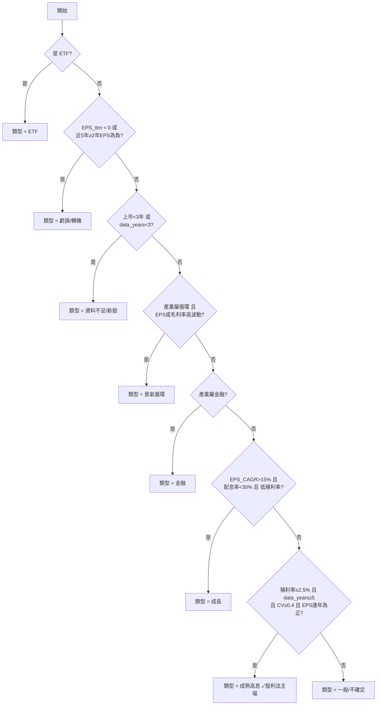
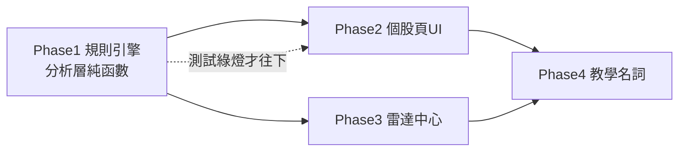

# 12. 估價適用性判斷、個股頁重整與雷達中心防誤導 — 完整規格

> 角色視角:金融產品經理 × 散戶投資教育顧問 × UX Designer × 軟體架構師。
> 目標:讓**股票小白不被誤導**、**懂股票的人也覺得合理**。
> 本規格基於現有實作撰寫:`app/analyze/valuation.py`、`app/screener/value.py`、`app/models.py`,並延續《04》(模組邊界、分析層純函數)、《06》(紅線與過度設計紀律)、《07》(三層資訊)。

---

## 0. 一句話結論

> **目前產品最危險的不是「算錯」,而是「對不該用股利法的股票,照樣給出一個看起來很精確的便宜/合理/昂貴價」。** 對一個主打「不誤導小白」的翻譯機來說,這是比當機更嚴重的問題——它在用權威的外觀,教使用者錯誤的心智模型。

3576 聯合再生現價 21,股利法卻給「便宜 1.6 / 合理 2 / 昂貴 3.2」,這不是 bug,是**方法用錯對象**。修法不能是「對 3576 打補丁」,而要建立一套「**這支股票該不該用這個方法**」的判斷層。

---

## 1. 現狀批判(不客氣版)

我讀了你的 `valuation.py` 和 `screener/value.py`。設計骨架是好的(分析層純計算、有 confidence、有 suitability_notes、有 warning),但有 5 個結構性問題:

### 批判 1:單一估價法套用到所有股票(根因)

`calculate_dividend_valuation()` 對**任何**有股利的股票都算 `便宜價/合理價/昂貴價`,用固定 6.25% / 5% / 3.125% 目標殖利率(或歷史殖利率區間)。

> 殖利率法只對「**成熟、配息穩定、股利是主要報酬來源**」的公司有意義。對成長股、景氣循環股、虧損股、新上市、低殖利率股,這個公式在數學上算得出數字,在投資上是**垃圾進、垃圾出**。產品現在沒有任何一層在問「這支股票適不適合用這個方法」。

### 批判 2:「低信心」標籤是 OK 繃,擋不住錨定效應

你已經有 `confidence = low` + `suitability_notes`,這很好。但 UI 仍然**把 1.6 / 2 / 3.2 三個精確數字當主角顯示**,旁邊加一行小字「低信心」。

> 行為經濟學的錨定效應(anchoring)告訴我們:使用者**先看到數字,才看到警語**。一個印在卡片正中央、精確到小數點的「便宜價 1.6」,殺傷力遠大於旁邊一行灰字「低信心」能挽回的。**正確做法不是加標籤,是當方法不適用時,根本不要把那三個數字當答案顯示。**

### 批判 3:錯誤的估價法在搶主視覺

個股頁目前是「一堆卡片堆起來」(你自己也這麼說)。股利估價卡和月營收、財報、健檢平起平坐,甚至因為它有「便宜/合理/昂貴」這種看起來很可操作的字眼,反而最吸睛。

> 結果是:**對 3576 這種股票,最不可信的那張卡,視覺權重最高。** 資訊架構沒有「依可信度決定視覺權重」的機制。

### 批判 4:雷達中心會系統性放大錯誤(最危險的一塊)

`build_value_screener_payload()` 的問題最嚴重,因為它是**排行榜**,排行榜天然帶有「這些是機會」的暗示:

- `_sort_key` 把所有股票用「離便宜價%」排序,**低信心股票和高信心股票混在同一個排行榜**。你算了 `confidence`、也數了 `low_confidence_rows`,但榜單(`below_cheap`、`near_cheap`)**沒有把它們排除或分開**。
- 「高殖利率」榜(`yield_available`)會把**殖利率陷阱**排到前面:股價崩跌→殖利率被動衝高、或一次性高股利→平均被墊高。這兩種都是「看起來便宜,其實是地雷」。
- 沒有任何 **EPS / 虧損** 把關:一家去年配息、今年轉虧的公司,仍會用舊股利算出便宜價、進榜單。
- `near_cheap` (離便宜價 10% 內) 對一次性高股利的公司會誤判成「快到便宜價了」。

> 一個主打「不報明牌」的產品,卻有一個「便宜股排行榜」把垃圾估值排在前面——**這跟報明牌的傷害是一樣的,只是包裝成資料**。

### 批判 5:缺少「公司分類」這一層,所以無法做方法路由

最根本的缺口:系統不知道「3576 是景氣循環股、7722 是低息成長/題材股、2412 是成熟高息股」。

> 沒有分類,就只能一招打天下。**人類分析師看到 3576 會先想「這是太陽能、景氣循環、近年才轉機」,自然就不會用存股殖利率法去估它。** 產品要把這個「先分類、再選方法」的直覺,變成明確規則。

**好消息**:我查過 `app/models.py`,你需要的訊號幾乎都已經在資料裡——`MarketValuation` 有 `pe_ratio` 和 `pb_ratio`、`FinancialStatement` 有 `eps` / `非營業損益` / `淨值`、`MonthlyRevenue` 有 `累計年增`、`StockProfile` 有 `industry_code` 和 `listed_date`。**本益比法、本淨比法、一次性獲利偵測、營收動能,全部都能用現有資料算,不需要新資料源。**

---

## 2. A 部分:哪些股票不適合用股利法估價

### 2.1 先講清楚:股利法的隱含假設

「近 N 年平均現金股利 ÷ 目標殖利率」這個公式,默默假設了四件事:

1. **股利穩定可預測**——所以「平均」才有代表性。
2. **公司成熟**——獲利與股利不會高速成長或衰退。
3. **股利是主要報酬來源**——所以用殖利率回推價格才合理。
4. **有足夠歷史**——至少 3 年、最好 5 年。

**只要任何一條不成立,股利法的輸出就不該當主要答案。** 下面逐類說明。

### 2.2 不適用 / 需降權的九類股票

| 類型 | 為什麼股利法失效 | 可偵測訊號(用現有欄位) | 代表案例 |
|------|------------------|--------------------------|----------|
| **① 新上市未滿 3 年** | 股利與股價歷史都太短,「平均」沒代表性 | `listed_date` 距今 < 3 年;`data_years < 3` | 7722 LINEPAY |
| **② 股利資料不足** | 樣本太少,平均不穩 | `data_years < 3`(硬門檻);3–4 年為偏弱 | 7722 |
| **③ 殖利率過低** | 股利不是報酬主軸,公式把便宜價壓到離譜低 | `current_yield < 1%`(硬);`< 2.5%`(軟) | 7722、3576 |
| **④ 配息不穩定** | 平均掩蓋巨大波動,有的年份甚至沒配 | 近 5 年現金股利**變異係數 CV > 0.4**;或 5 年內**≥2 年零股利** | 多數電子代工 |
| **⑤ 成長股** | 價值來自成長,公司刻意少配多留;低殖利率+高 EPS 成長 | `EPS 年複合成長 > 15%` 且 `配息率 < 30%` 且低殖利率 | 多數題材/半導體成長股 |
| **⑥ 景氣循環股** | 獲利與股利隨景氣大起大落,歷史均值在循環高/低點會嚴重誤導 | `industry_code` ∈ 循環產業集 **且** 近年 EPS 或毛利率**高波動** | **3576 聯合再生(太陽能)**、鋼鐵、航運、面板、記憶體、塑化 |
| **⑦ 虧損 / 轉機股** | 沒有可持續的股利基礎,過去配息可能來自老本 | `EPS_ttm < 0` 或 5 年內 `≥2 年 EPS 為負` | 3576(歷史多年虧損後轉機) |
| **⑧ 一次性高股利** | 處分資產/業外/減資退現墊高平均,便宜價被灌水 | 某年股利 > 近年**中位數 × 2**;或該年 `業外損益 / 稅前淨利 > 50%` | 偶發性 |
| **⑨ 特殊資本變動** | 減資、合併、以股票股利為主→歷年每股股利不可比 | 股本大幅變動;`stock_dividend` 占比高;期間有減資 | 個案 |

### 2.3 產業要不要分開看?——以財務特徵為主,產業為輔

你問 ETF / 金融 / 建設 / 科技要不要分開。我的判斷(架構師視角,避免《06》O6 的「過早抽象」):

> **不要建一套完整的「每個產業一套估價邏輯」的抽象層**(那會變成永遠維護不完的怪物)。**而是用「財務特徵」當主判斷,「產業」只當兩個用途**:(a) 偵測難從幾年資料看出的「景氣循環」性質;(b) 對 ETF / 金融這兩個本質就不同的類別做特例路由。

| 類別 | 怎麼處理 | 主要估價方法 | 理由 |
|------|----------|--------------|------|
| **ETF** | **特例**:完全不套個股股利法 | 配息殖利率「區間」+ 折溢價(對淨值) | ETF 沒有「公司獲利」,股利法的 EPS/配息率邏輯不適用 |
| **金融股** | 用 `industry_code` 標記 | **本淨比(PB)+ ROE** 為主,殖利率為輔 | 銀行/壽險獲利受利率與法規影響,業界慣用 PB |
| **景氣循環股**(鋼鐵/航運/面板/太陽能/記憶體/塑化/水泥/航空) | `industry_code` 標記 + EPS/毛利率波動驗證 | **本淨比(PB)區間** + 營收/毛利率循環位置 | 循環股「低本益比常是高點」,殖利率均值最危險 |
| **建設/營建股** | `industry_code` 標記 | 看 PB / 推案認列節奏,股利法降權 | 推案認列使獲利與股利極度不規則 |
| **科技股** | **不要一刀切**,回到財務特徵分流 | 成熟配息型→可用殖利率;成長型→本益比+成長 | 科技股異質性最高,用特徵分而非產業標籤 |
| **一般成熟製造/民生** | 走財務特徵主判斷 | 殖利率法(若通過適用性) | 這才是股利法的主場 |

> 結論:**產業是「提示」,不是「判決」。** 判決由財務特徵(殖利率水準、配息穩定度、EPS 正負與成長、配息率)下;產業只在「光看數字會漏判循環股」和「ETF/金融本質不同」這兩處補位。這需要一張小小的 `industry_code → 類別` 對照表(靜態檔,人工維護一次),不是一套抽象框架。

---

## 3. B 部分:估價方法適用性判斷(明確規則)

整體設計分三步:**① 算訊號 → ② 分類公司 → ③ 決定估價狀態與方法路由。** 全部是分析層純函數(可單元測試),不碰 AI、不碰網路。

### 3.1 輸入訊號定義(全部用現有欄位算)

| 訊號 | 定義 | 來源欄位 |
|------|------|----------|
| `data_years` | 近 5 年有完整年度現金股利的年數 | `DividendRecord`(沿用現有 `_annual_cash_dividends_by_year`) |
| `years_since_listing` | 上市至今年數 | `StockProfile.listed_date` |
| `current_yield` | 近 5 年平均現金股利 ÷ 現價 ×100% | 現有 `average_cash` / `DailyPrice.close` |
| `market_yield` | 官方殖利率 | `MarketValuation.dividend_yield` |
| `dividend_cv` | 近 5 年現金股利的變異係數(標準差/平均) | `DividendRecord` |
| `zero_div_years` | 近 5 年內現金股利為 0 的年數 | `DividendRecord` |
| `eps_ttm` | 近四季 EPS 合計 | `FinancialStatement.eps` |
| `eps_neg_years` | 近 5 年(或可得年數)EPS 為負的年數 | `FinancialStatement` |
| `eps_cagr` | EPS 年複合成長率 | `FinancialStatement.eps` |
| `payout_ratio` | 現金股利 ÷ EPS | `DividendRecord` / `FinancialStatement` |
| `oneoff_flag` | 某年股利 > 近年中位數×2,或該年 `非營業損益/稅前淨利 > 50%` | `DividendRecord` / `FinancialStatement.non_operating_income_expense` |
| `earnings_volatility` | 近年 EPS 或毛利率(`gross_profit/revenue`)的變異係數 | `FinancialStatement` |
| `pe_ratio` / `pb_ratio` | 本益比 / 本淨比 | `MarketValuation` |
| `rev_yoy` / `rev_cum_yoy` | 月營收年增 / 累計年增 | `MonthlyRevenue` |
| `industry_category` | 由 `industry_code` 對照得 `cyclical/financial/etf/construction/general` | 靜態對照表(附錄 B) |

### 3.2 公司類型分類器(優先序,第一個命中為準)



### 3.3 估價狀態:四態 + 優先序規則

每支股票對「股利法」產出一個 `state`(四選一)。**規則由上往下,第一個命中為準。**

| 優先 | 條件(命中即為此狀態) | `state` | UI 行為 |
|------|------------------------|---------|---------|
| 1 | 類型 = ETF | `not_applicable` | 不顯示個股股利法;改顯示「配息區間 + 折溢價」 |
| 2 | 類型 = 虧損/轉機(`eps_ttm<0` 或 ≥2 年虧損) | `not_applicable` | 收合股利法;主顯示營收動能/毛利率/是否轉正 |
| 3 | `current_yield < 1%`(硬門檻) | `not_applicable` | 收合;明說「股利太低,便宜價不具參考性」 |
| 4 | `data_years < 3` 或 上市 < 3 年 | `not_applicable` | 收合;明說「資料不足,等配息紀錄變長」 |
| 5 | `zero_div_years ≥ 2`(時有時無) | `not_applicable` | 收合;明說「配息不穩定」 |
| 6 | 類型 = 景氣循環 | `low_confidence` | 顯示但淡化;**主推 PB 區間**;警語「循環股低本益比常是高點」 |
| 7 | `1% ≤ current_yield < 2.5%` 或 類型=成長 | `low_confidence` | 顯示但淡化;並列本益比法 |
| 8 | `dividend_cv > 0.4` 或 `payout_ratio > 100%` 或 `oneoff_flag` | `low_confidence` | 顯示但加註(一次性已用中位數修正) |
| 9 | `3 ≤ data_years < 5` | `low_confidence` | 顯示但標「尚非完整 5 年」 |
| 10 | 以上皆不命中(成熟高息、≥5 年、殖利率足、穩定) | `applicable` | 正常顯示為主要估值卡 |

> 註:`collapse`(收合淡化)與 `not_applicable`(明示不適用)在資料上是同一個 state 家族,差別只在 UI 強度。實作上用 `state ∈ {applicable, low_confidence, not_applicable}` 三值,另以 `reasons[]` 帶原因碼決定文案。

### 3.4 方法路由表(類型 → 該看什麼)

| 公司類型 | 主要方法 | 次要方法 | 應避免 | 一句話原則 |
|----------|----------|----------|--------|------------|
| 成熟高息 | 殖利率法 ✓ | 本益比區間 | — | 股利法主場 |
| 成長 | 本益比區間 / PEG | EPS 與營收成長動能 | 殖利率法 | 價值在成長,不在配息 |
| 景氣循環 | **本淨比(PB)區間** | 營收/毛利率循環位置 | 單一本益比、殖利率均值 | 低 PE 常是循環高點 |
| 金融 | **本淨比(PB)+ ROE** | 殖利率法 | 純本益比 | 業界慣用 PB |
| 虧損/轉機 | **不估價** | 營收動能、毛利率趨勢、是否轉正、現金流 | 殖利率法、本益比 | 先看活不活得下去 |
| ETF | 配息殖利率區間 | 折溢價(對淨值) | 個股股利法 | 沒有公司獲利可言 |
| 資料不足/新股 | 暫不估價 | 與同業 PE/PB 比較 | 任何歷史均值法 | 等資料長出來 |
| 一般/不確定 | 本益比 + 本淨比並列 | 殖利率法(低信心) | 單一法下定論 | 多看幾把尺 |

### 3.5 輸出契約 `valuation_suitability`(給 Codex 的 JSON)

分析層新增此輸出(`app/analyze/valuation.py` 擴充或新檔 `app/analyze/suitability.py`):

```json
{
  "stock_id": "3576",
  "company_type": "cyclical",
  "company_type_label": "景氣循環股(太陽能)",
  "company_type_confidence": "medium",
  "dividend_valuation": {
    "state": "not_applicable",
    "reasons": ["yield_too_low", "loss_history", "cyclical"],
    "values": { "cheap": 1.6, "fair": 2.0, "expensive": 3.2 },
    "show_values": false
  },
  "recommended_methods": {
    "primary": "pb_band",
    "secondary": ["revenue_momentum", "gross_margin_trend"],
    "avoid": ["yield", "pe_single"]
  },
  "data_confidence": {
    "level": "low",
    "factors": ["yield<1%", "eps_negative_years=3", "dividend_years=2"]
  },
  "headline": "這檔不適合用股利法估價"
}
```

原因碼 `reasons[]` 列舉(對應文案,見 D 部分):`yield_too_low`、`loss_history`、`insufficient_data`、`newly_listed`、`unstable_dividend`、`cyclical`、`growth_stock`、`one_off_dividend`、`high_payout`、`etf`、`capital_change`。

> **架構鐵則(延續《04》《06》R2):** `state`、`company_type`、`reasons` 全部由**分析層純函數**計算,固定輸入→固定輸出,可單元測試。AI/解說層只負責把 `reasons[]` 轉成白話,**不參與判斷、不算數字**。`values` 仍然算(老手展開可看),但由 `show_values: false` 控制預設不秀。

### 3.6 可調門檻常數(預設值,集中管理)

放在 `app/analyze/suitability.py` 頂部或設定檔,方便日後調校(延續「Prompt/參數不寫死」精神):

| 常數 | 預設 | 意義 |
|------|------|------|
| `YEARS_FULL_SAMPLE` | 5 | 完整樣本年數 |
| `YEARS_MIN_SHOW` | 3 | 低於此 → 資料不足不適用 |
| `YIELD_HARD_FLOOR` | 1.0% | 低於此 → 硬性不適用 |
| `YIELD_SOFT_FLOOR` | 2.5% | 低於此 → 低信心/改看他法 |
| `DIVIDEND_CV_MAX` | 0.40 | 高於此 → 配息不穩 |
| `ZERO_DIV_YEARS_MAX` | 1 | 5 年內零配息超過此數 → 不穩 |
| `EPS_NEG_YEARS_MAX` | 1 | 5 年內虧損超過此數 → 虧損型 |
| `EPS_CAGR_GROWTH` | 15% | 高於此(且低配息低息)→ 成長型 |
| `PAYOUT_HIGH` | 100% | 高於此 → 吃老本疑慮 |
| `PAYOUT_GROWTH` | 30% | 低於此(且高成長)→ 成長型佐證 |
| `ONEOFF_MULTIPLE` | 2.0 | 單年股利 > 中位數×此倍 → 一次性 |
| `NONOP_SHARE_MAX` | 50% | 業外/稅前 高於此 → 一次性獲利疑慮 |
| `LISTED_MIN_YEARS` | 3 | 上市年數門檻 |

---

## 4. C 部分:個股頁資訊架構重設計

### 4.1 設計原則(針對「卡片堆疊」的解法)

| # | 原則 | 解決什麼 |
|---|------|----------|
| 1 | **答案優先,佐證收合**(延續《07》三層) | 新手先看結論,不被原始數據淹沒 |
| 2 | **視覺權重 ∝ 可信度** | 不讓低信心的估價搶主視覺(批判 3) |
| 3 | **先定性,再給數字**:頂部一個「公司類型標籤」 | 框住整頁脈絡,讓使用者知道該用哪把尺 |
| 4 | **方法跟著類型走**:估值卡顯示「適配的方法」,不適用就換卡 | 根治批判 1 |
| 5 | **可信度徽章常駐**:每張估值/健檢卡右上角一個燈號 | 滿足「明確顯示資料可信度/方法適用性」 |
| 6 | **分區 + 錨點導覽**,不是平鋪卡片 | 老手能跳,新手有順序 |

### 4.2 頁面骨架:三層 + 類型標籤 + 可信度

```
┌─ 頂部識別區 ────────────────────────────────────┐
│ 代號 名稱 │ 盤中報價 │ [公司類型標籤] [資料可信度燈號] │  ← 新增類型標籤
├─ 第一層:30 秒看懂(答案) ───────────────────────┤
│ 明牌驗證 3 句 · 白話健檢總結 · 「適配方法」一句話估值 │
├─ 第二層:為什麼(白話健檢 6 卡,每卡帶可信度) ──────┤
│ 趨勢 · 位階 · 獲利 · 波動 · 股利穩定 · 估值(自適應) │
├─ 第三層:完整資料(老手展開 / 進階模式常駐) ────────┤
│ 月營收 · 財報 · 股利歷史 · 估價試算(全方法+參數) ·   │
│ 日線圖 · 事件線 · 最近資料表                          │
└──────────────────────────────────────────────────┘
```

### 4.3 關鍵:估值卡的「自適應」三態行為

同一個位置,依 `state` 長出不同的卡。**這是整個重設計的核心。**

| state | 卡片標題 | 主內容 | 便宜/合理/昂貴 |
|-------|----------|--------|----------------|
| `applicable` | 「估值:殖利率法」+ 🟢高信心 | 便宜/合理/昂貴 三價 + 現價位置 | **當主角顯示** |
| `low_confidence` | 「估值:殖利率法」+ 🟡低信心 | 縮小顯示三價 + 「並列參考:本益比法」+ 原因 | 顯示但**縮小、淡化、不置中** |
| `not_applicable` | 「估值:此檔不適合股利法」+ 🔴 | **一句話結論 + 原因 + 建議改看的方法**;三價收進「仍要看?」摺疊區 | **預設隱藏**,需點開 |

### 4.4 ASCII 線框圖

#### 狀態 A:適用(例:2412 中華電,成熟高息)

```
┌──────────────────────────────────────────────────────────────────────┐
│ 2412 中華電  125.8 ▲+0.8%   [🏷 成熟高息股]            [資料可信度 🟢高]│
├──────────────────────────────────────────────────────────────────────┤
│ 30 秒看懂:防禦型電信,配息穩、波動低;目前股價位於近一年偏高位置。     │
├──────────────────────────────────────────────────────────────────────┤
│ ┌─ 估值 · 殖利率法 ───────────────🟢 高信心─┐ ┌─ 股利穩定 ───🟢─┐      │
│ │  便宜 118    [合理 132]    昂貴 158        │ │ 連 20 年配息    │      │
│ │  ──●──────────────────────  現價 125.8     │ │ 殖利率 4.3%     │      │
│ │  目前接近合理價偏便宜一側                  │ │ 配息率 80% 穩定 │      │
│ └────────────────────────────────────────────┘ └─────────────────┘      │
│ (其餘健檢卡:趨勢/位階/獲利/波動 …)                                     │
└──────────────────────────────────────────────────────────────────────┘
```

#### 狀態 C:不適用(例:3576 聯合再生,景氣循環+轉機+低息)⭐ 核心案例

```
┌──────────────────────────────────────────────────────────────────────┐
│ 3576 聯合再生  21.05 ▲+6.06%  [🏷 景氣循環股·太陽能]   [資料可信度 🔴低]│
├──────────────────────────────────────────────────────────────────────┤
│ 30 秒看懂:太陽能、景氣循環、近年才轉機。近期股價強、營收單月回升,     │
│ 但累計營收仍年減、獲利需確認是否一次性。⚠️ 這檔不適合用股利法估價。     │
├──────────────────────────────────────────────────────────────────────┤
│ ┌─ 估值 · 此檔不適合股利法 ─────────────────────────────🔴───────────┐ │
│ │ 為什麼不適合:                                                       │ │
│ │  • 殖利率不到 1%(估計年股利僅 0.1 元)→ 便宜價不具參考性          │ │
│ │  • 屬景氣循環股,歷史均值在循環高/低點會嚴重誤導                    │ │
│ │  • 近年曾虧損,股利基礎不穩定                                        │ │
│ │ 建議改看 👉 本淨比(PB)區間 · 營收動能 · 毛利率趨勢                 │ │
│ │ ▸ 仍要看股利法試算結果?(已知參考性低)             〔點開〕       │ │
│ └─────────────────────────────────────────────────────────────────────┘ │
│ ┌─ 改看:本淨比(PB) ─🟡─┐ ┌─ 營收動能 ──🟡─┐ ┌─ 獲利能力 ──🔴─┐    │
│ │ 目前 PB 1.8 倍         │ │ 單月 YoY +12%   │ │ EPS 0.4(轉正)  │    │
│ │ 近 5 年區間 0.9–2.4    │ │ 累計 YoY −8% ⚠️ │ │ 業外占比偏高 ⚠️ │    │
│ │ 處於區間中上緣        │ │ 「單月回升但    │ │ 「需確認是否   │    │
│ │                       │ │  累計仍衰退」   │ │  一次性」      │    │
│ └────────────────────────┘ └─────────────────┘ └─────────────────┘    │
│                                       ⓘ 資料解讀,非投資建議,不預測股價 │
└──────────────────────────────────────────────────────────────────────┘
```

> 對比兩態的關鍵:**3576 的版面,最大的那塊不再是「便宜 1.6」,而是「為什麼不適合 + 該改看什麼」。** 三個替代方法卡接手主視覺,每張帶可信度燈號。便宜/合理/昂貴被降到一個要主動點開、且標明「參考性低」的摺疊區——既不騙小白,也不擋老手。

### 4.5 區塊順序與導覽(取代「卡片堆疊」)

固定錨點順序(新手由上而下;老手用右側/頂部錨點跳):
`報價 → 30秒看懂 → 估值(自適應) → 健檢6卡 → 月營收 → 財報 → 股利歷史 → 日線圖 → 事件線 → 原始資料表`。
進階模式:第三層預設全展開;新手模式:第三層收合,點「看完整資料」展開。

---

## 5. D 部分:白話文案庫(可直接貼進 UI)

> 全部為規則式模板(不需 LLM,延續《06》O9「固定知識用靜態文案,品質更穩又省錢」)。`{{變數}}` 由分析層帶入。語氣:講人話、不嚇人、不下指令、結尾不忘「非投資建議」。

### 5.1 公司類型標籤(頂部)

| 類型 | 標籤文字 | 點開說明(tooltip) |
|------|----------|--------------------|
| 成熟高息 | `🏷 成熟高息股` | 「獲利穩定、長期配息,適合用殖利率法看貴不貴。」 |
| 成長 | `🏷 成長股` | 「公司把賺的錢留下來擴張,配息少;看貴不貴要用本益比和成長性,不是殖利率。」 |
| 景氣循環 | `🏷 景氣循環股·{{產業}}` | 「獲利隨景氣大起大落。這類股票『便宜的本益比』常出現在景氣高點,要特別小心。」 |
| 金融 | `🏷 金融股` | 「銀行/壽險獲利受利率與法規影響,業界習慣用『本淨比(股價相對淨值)』來看。」 |
| 虧損/轉機 | `🏷 轉機股(近年曾虧損)` | 「公司還在從虧損中翻身,先看活得好不好(營收、毛利、是否轉正),還談不上估值。」 |
| ETF | `🏷 ETF` | 「ETF 是一籃子股票,沒有單一公司的獲利,看『配息率區間』和『折溢價』,不適用個股股利法。」 |
| 資料不足/新股 | `🏷 新上市(資料還短)` | 「上市時間短、配息紀錄少,任何用歷史平均的估價都還不準,先觀察。」 |

### 5.2 估價「不適用」主文案(依 `reasons[]` 組合)

**標題(固定):** `這檔不適合用股利法估價`

**原因句(命中哪個就顯示哪句,可多條):**

| 原因碼 | 文案 |
|--------|------|
| `yield_too_low` | 「殖利率不到 1%(估計年現金股利僅 {{avg_cash}} 元),用固定殖利率回推會把『便宜價』壓到遠低於市價,不具參考性。」 |
| `loss_history` | 「公司近年曾經虧損,沒有穩定的獲利支撐配息,股利法的前提不成立。」 |
| `insufficient_data` | 「目前只有 {{data_years}} 年股利紀錄(不足 3 年),平均值還不穩。」 |
| `newly_listed` | 「上市未滿 3 年,股價與配息歷史都太短,估價先別當主要依據。」 |
| `unstable_dividend` | 「配息忽高忽低(近 5 年有 {{zero_years}} 年沒配),平均會騙人。」 |
| `cyclical` | 「這是景氣循環股,獲利大起大落;用歷史平均股利估價,在景氣高/低點都會嚴重誤導。」 |
| `growth_stock` | 「這比較像成長股——公司少配息、把錢留著擴張,該看的是本益比與成長性,不是殖利率。」 |
| `one_off_dividend` | 「過去某年有一次性的高股利(可能來自賣資產或業外),已用中位數修正,但仍要小心。」 |
| `high_payout` | 「配息率超過 100%(配的比賺的多),等於在吃老本,難以長期維持。」 |

**建議改看句(依 `recommended_methods.primary`):**

| primary | 文案 |
|---------|------|
| `pb_band` | 「建議改看 👉 **本淨比(PB)區間**(股價相對公司淨值,現在算貴還便宜)。」 |
| `pe_band` | 「建議改看 👉 **本益比區間**(股價相對每年賺的錢)+ 成長動能。」 |
| `revenue_momentum` | 「建議先看 👉 **營收動能與毛利率趨勢**,確認公司是否真的好轉。」 |
| `none` | 「目前任何估價法都不可靠,建議先觀察基本面是否站穩,再談貴不貴。」 |

### 5.3 月營收「近期成長但累計衰退」白話

> 當 `rev_yoy > 0` 但 `rev_cum_yoy < 0`:
>
> 「**單月營收回升(年增 {{rev_yoy}}%),但今年累計仍比去年少({{rev_cum_yoy}}%)。** 代表最近一個月轉好,但整年還沒追回來——一個月的好轉還不能當成趨勢,要再看幾個月確認。」

### 5.4 獲利「需確認一次性」白話

> 當 `非營業損益 / 稅前淨利 > 50%`:
>
> 「**這季賺的錢,有很大一部分來自本業以外(如業外投資、處分資產),不是賣產品/服務賺的。** 這種獲利通常不會每季都有,看獲利能力時要把它分開看。」

### 5.5 殖利率過低(便宜價不具參考性)

> 「**這檔殖利率很低({{current_yield}}%),股利不是它的主要報酬來源。** 硬用殖利率法會算出一個遠低於市價的『便宜價』,那只是公式的產物,不代表股價該跌到那裡。」

### 5.6 低信心(顯示但淡化)通用前綴

> 「⚠️ 以下估價參考性偏低({{reason_short}}),請當成一個粗略區間,不要當買賣點。」

### 5.7 3576 聯合再生:完整文案組合範例(可整段套用)

```
頂部標籤:🏷 景氣循環股·太陽能          資料可信度:🔴 低

30 秒看懂:
太陽能、景氣循環、近年才從虧損轉機。近期股價走強(今日 +6.06%、近 20 日約 +20%),
單月營收回升,但今年累計營收仍年減,且獲利要確認是不是一次性因素。
⚠️ 這檔不適合用股利法估價。

估值卡(不適用):
【這檔不適合用股利法估價】
• 殖利率不到 1%(估計年現金股利僅 0.1 元)→ 便宜價不具參考性
• 這是景氣循環股,歷史平均股利在循環高/低點都會嚴重誤導
• 公司近年曾虧損,沒有穩定獲利支撐配息
建議改看 👉 本淨比(PB)區間 · 營收動能 · 毛利率趨勢
▸ 仍要看股利法試算(便宜1.6/合理2/昂貴3.2,參考性低)〔點開〕

營收卡:
單月營收回升(年增 +12%),但今年累計仍比去年少(−8%)。最近一個月轉好,
但整年還沒追回來,要再看幾個月確認。

獲利卡:
EPS 由負轉正,但這季有相當比例來自本業以外,需確認是否為一次性因素。

結尾:ⓘ 以上為資料解讀,不構成投資建議,也不預測股價。
```

---

## 6. E 部分:雷達中心防誤導設計

### 6.1 核心原則

> 雷達中心是**排行榜**,排行榜天生帶「這些是機會」的暗示。因此第一原則是:**任何依賴估價可信度的榜單,預設只放高信心股票;低信心的另外分區,絕不混排。**

四條設計準則:

1. **依賴估價的榜單(撿便宜/低於便宜價/近便宜價)→ 預設排除 `not_applicable` 與 `low_confidence`。** 因為「便宜」是相對「合理價」,合理價不可信時,「便宜」就是假的。
2. **高殖利率榜 → 必須偵測並標記「殖利率陷阱」。**
3. **純價格榜(漲最多/跌最多)→ 可含全部,但加中性框架與基本面提示,避免「跌最多=撿便宜」的暗示。**
4. **低信心股票 → 分區、淡化、附一句原因;永不佔據主榜前段。**

### 6.2 各榜單處理對照

| 榜單 | 依賴估價? | 預設處理 | 額外標記 |
|------|-----------|----------|----------|
| 撿便宜 / 低於便宜價 | 是 | **只列 `applicable`(高信心)** | 切換可顯示低信心(獨立分區) |
| 近便宜價(10% 內) | 是 | 同上 | 同上 |
| 高殖利率 | 是(殖利率) | 列出,但跑**殖利率陷阱偵測**,中陷阱者移到「⚠️ 疑似陷阱」分區 | 陷阱原因標籤 |
| 漲最多 | 否 | 全部可列(價格事實) | 「這是漲幅排行,非推薦」+ 可選顯示基本面燈號 |
| 跌最多 | 否 | 全部可列 | 「跌多不等於便宜」提醒 + 基本面燈號(避免接刀) |
| 5 年完整資料 | — | 保留,作為「高信心宇宙」 | 這本身就是品質濾網,很好 |

### 6.3 殖利率陷阱偵測(高殖利率榜專用)

殖利率高,可能是好事(便宜),也可能是地雷。命中任一即標 `⚠️ 疑似高殖利率陷阱` 並移出主榜:

| 陷阱類型 | 偵測條件 | 標籤文案 |
|----------|----------|----------|
| 股價崩跌型 | 近 60 日跌幅 > 25% 導致殖利率被動衝高 | 「殖利率高是因為股價大跌,不是配息變好」 |
| 一次性高股利 | `oneoff_flag = true` | 「含一次性高股利,明年未必有」 |
| 吃老本 | `payout_ratio > 100%` | 「配的比賺的多,難長期維持」 |
| 獲利衰退 | `eps_ttm` 年減 > 30% 或轉虧 | 「獲利正在衰退,高殖利率可能撐不住」 |

### 6.4 篩選器(使用者可控)

雷達中心頂部提供篩選列(預設值見括號):

- ☑ 只看股利法適用(預設**開**)
- ☑ 排除新上市未滿 3 年(預設**開**)
- ☑ 排除資料不足(< 3 年)(預設**開**)
- ☐ 排除低殖利率(< 2.5%)
- ☐ 排除景氣循環股
- ☐ 排除近年虧損
- 最低信心等級:[高 / 中 / 低](預設**中**)

> 預設值的態度:**寧可預設保守(只給高信心),讓老手主動放寬,也不要預設全給、讓小白自己踩雷。**

### 6.5 低信心股票的顯示方式

不是隱藏到看不見,也不是混排,而是**獨立的淡化分區**:

```
┌─ 撿便宜排行(高信心) ───────────────────────────────────┐
│ 1. 2412 中華電   現價125.8  便宜118  低於合理 -4.7%  🟢   │
│ 2. 2882 國泰金   …                                       │
│ 3. 1101 台泥     …                                       │
└──────────────────────────────────────────────────────────┘
   ▾ 另有 23 檔「低信心/方法不適用」已收合(估值參考性低) 〔顯示〕
┌─ ⚠️ 低信心區(僅供參考,估值不可靠) ─────────[淡灰底]──┐
│ • 3576 聯合再生  景氣循環·近年虧損  → 不適合股利法        │
│ • 7722 LINEPAY   新上市·殖利率<1%   → 資料不足           │
└──────────────────────────────────────────────────────────┘
```

### 6.6 雷達中心頂部固定聲明

> 「這是**資料排行榜,不是推薦清單**。排行只反映數字,每一檔都需要自己進個股頁驗證。本工具不報明牌、不預測股價。」

### 6.7 對現有程式的具體改動點

| 現有位置 | 問題 | 改動 |
|----------|------|------|
| `build_value_screener_payload()` 每個 item | 只有 `confidence`,無 `state`/`company_type` | 引入 Phase 1 的 `valuation_suitability`,每 item 帶 `state`、`company_type`、`reasons` |
| `below_cheap` / `near_cheap` 組裝 | 含低信心 | 加 `if item.state == "applicable"` 過濾;另存 `low_confidence_below_cheap` |
| `yield_available` | 無陷阱偵測 | 加 `yield_trap` 欄位與分區 |
| `_sort_key` | 全體混排 | 主榜只排 applicable;低信心區單獨排 |
| `summary` | 已有 `low_confidence_rows` | 新增各榜 `excluded_low_confidence` 計數,供 UI 顯示「已收合 N 檔」 |

---

## 7. F 部分:Codex 可施工規格(4 Phase)

> 格式延續《08》。鐵則(延續《04》《06》):分析層純函數可單測、AI 不算數字不判斷、外部資料只進 `sync`、每模組附契約測試。**Phase 1 是地基,必須先做且測試綠燈,才動 UI。**

### Phase 1:估價適用性規則引擎(分析層)

**目標**
建立「公司分類 + 估價狀態 + 方法路由」的純函數,輸出 `valuation_suitability` 契約(見 3.5)。這是後面三個 Phase 的資料來源。

**要改 / 新增的畫面**
無(純後端)。先以 CLI 驗證,延續現有 `app/cli.py` 風格,例如 `python -m app.cli suitability 3576`。

**要新增的資料欄位 / 契約**

- 新檔 `app/analyze/suitability.py`,函式 `assess_valuation_suitability(...) -> ValuationSuitability`。
- `ValuationSuitability` dataclass:`company_type`、`company_type_label`、`company_type_confidence`、`state`、`reasons: list[str]`、`recommended_methods`、`data_confidence`、`headline`。
- 新增純計算輔助:`dividend_cv`、`zero_div_years`、`eps_neg_years`、`eps_cagr`、`payout_ratio`、`oneoff_flag`、`earnings_volatility`。
- 新增 `app/analyze/methods.py`:`pe_band(...)`、`pb_band(...)`(用 `MarketValuation.pe_ratio/pb_ratio` 與歷史區間算便宜/合理/昂貴),供「改看」卡使用。
- 靜態檔 `data/industry_categories.json`:`industry_code → {cyclical|financial|construction|etf|general}`(附錄 B)。
- 門檻常數集中在 `suitability.py` 頂部(見 3.6)。
- `calculate_dividend_valuation()` 的回傳**保留不變**,另外掛上 `suitability`(向後相容,不破壞現有 UI)。

**驗收標準**

- 單元測試固定輸入→固定輸出,**以 3576、7722 為 fixture**:
  - 3576 → `state = not_applicable`,`company_type = cyclical`,`reasons` 含 `yield_too_low` 與 `cyclical`(或 `loss_history`),`recommended_methods.primary = pb_band`。
  - 7722 → `state = not_applicable`,`reasons` 含 `insufficient_data`/`newly_listed`/`yield_too_low`。
  - 一檔成熟高息(如 2412)→ `state = applicable`,`company_type = mature_dividend`。
- 每個原因碼至少一個對應測試;門檻邊界值(yield 0.99% vs 1.01%)各一測試。
- `pe_band`/`pb_band` 純函數有固定輸入輸出測試。

**不做什麼**

- ❌ 不引入機器學習/自動分群——用明確規則,可解釋、可測。
- ❌ 不接新資料源——只用現有欄位。
- ❌ 不讓 AI 參與分類或算數字。
- ❌ 不刪除現有 `confidence`/`suitability_notes`(漸進式,先疊加)。

---

### Phase 2:個股頁 UI 重整(自適應估值卡 + 類型標籤 + 可信度)

**目標**
把個股頁從「卡片堆疊」改為「三層 + 類型標籤 + 自適應估值卡」(見 C),讓錯誤適用的估價法不再搶主視覺。

**要改 / 新增的畫面**

- 個股頁頂部:新增**公司類型標籤** + **資料可信度燈號**(🟢🟡🔴)。
- 個股頁估值區:改為**自適應三態卡**(`applicable` / `low_confidence` / `not_applicable`,見 4.3、4.4)。
- 健檢 6 卡:每卡右上角加可信度燈號;新增「估值(自適應)」「股利穩定」卡。
- 第三層(月營收/財報/股利歷史/日線/事件/原始表)收進可展開區;進階模式常駐。
- `not_applicable` 時,便宜/合理/昂貴收進「仍要看?」摺疊區。

**要新增的資料欄位 / 契約**

- `app/web/api.py` 個股 API 回傳加上 `suitability`(來自 Phase 1)。
- `app/explain/rule_based.py` 新增依 `reasons[]` 與 `company_type` 產生 D 部分文案的模板函式(純規則,不呼叫 LLM)。
- 前端依 `state` 切換卡片樣式(CSS class:`val-applicable / val-low / val-na`)。

**驗收標準**

- 開 3576 → 估值區標題為「此檔不適合用股利法估價」,便宜/合理/昂貴**預設不可見**,需點「仍要看?」才展開;類型標籤顯示「景氣循環股」,可信度 🔴。
- 開 2412(或任一成熟高息)→ 估值區正常顯示三價 + 🟢。
- 切換新手/進階模式,第三層收合/展開正確。
- 所有專業名詞可點(沿用 glossary tooltip)。
- 視覺上:`not_applicable` 卡的字級/面積**不大於**同頁替代方法卡(用視覺回歸或人工驗收截圖)。

**不做什麼**

- ❌ 不改頁面骨架以外的導航結構(延續《03》「骨架不變只長分頁」)。
- ❌ 不做動畫/華麗過場,先把資訊層級做對。
- ❌ 不在前端重算任何數字——只渲染後端給的值。

---

### Phase 3:雷達中心篩選與信心標示

**目標**
讓雷達中心不再把低信心/陷阱股票混進排行榜(見 E)。

**要改 / 新增的畫面**

- 雷達中心頂部:固定聲明(6.6)+ 篩選列(6.4)。
- 撿便宜/低於便宜/近便宜:主榜只放高信心;下方「低信心區」淡化分區(6.5)。
- 高殖利率榜:中陷阱者移到「⚠️ 疑似陷阱」分區並標原因。
- 漲最多/跌最多:加中性框架文案 + 基本面燈號。

**要新增的資料欄位 / 契約**

- `build_value_screener_payload()` 每 item 併入 `state`、`company_type`、`reasons`、`yield_trap`(bool + reason)。
- payload 新增分區陣列:`below_cheap_high_conf`、`below_cheap_low_conf`、`yield_normal`、`yield_trap`。
- `summary` 加各榜 `excluded_low_confidence` 計數。
- 篩選器狀態走前端(本地記住使用者選擇)。

**驗收標準**

- 預設檢視:3576、7722 **不**出現在「撿便宜(高信心)」主榜;出現在「低信心區」並標原因。
- 製造一檔「股價腰斬→高殖利率」的測試資料 → 進「⚠️ 疑似陷阱」分區,標「股價大跌」。
- 一次性高股利測試資料 → 標「含一次性高股利」。
- 關閉「只看股利法適用」篩選 → 低信心股票才併入,且仍有視覺區隔。
- 排行榜算法有單元測試(固定輸入→固定分區結果)。

**不做什麼**

- ❌ 不做「綜合評分/星等」這種把多指標混成一個分數的黑盒(會變成變相報明牌)。
- ❌ 不排序「推薦度」——只排客觀數字(離便宜價%、漲跌幅、殖利率)。
- ❌ 不預設把低信心股票完全隱藏(要可被老手叫出來)。

---

### Phase 4:教學與名詞解釋整合

**目標**
讓「為什麼這檔不適合股利法」「什麼是本淨比/本益比/景氣循環」變成可學的內容,把誤導的時刻轉成教學的時刻。

**要改 / 新增的畫面**

- 名詞字典(`app/glossary`)新增條目:殖利率法、本益比法、本淨比法、景氣循環股、成長股、配息率、變異係數、殖利率陷阱、填權息、業外損益。
- 每個「不適用原因」旁加「為什麼?」連到對應名詞/迷你教學卡。
- `not_applicable` 估值卡底部:「想知道為什麼這檔不能用股利法?」→ 教學。
- 雷達中心「疑似陷阱」標籤可點開解釋。

**要新增的資料欄位 / 契約**

- `app/glossary` 資料檔新增上述詞條(白話 + 一個真實範例,延續《07》E)。
- `reasons[]` 原因碼 → glossary key 的對照表。

**驗收標準**

- 個股頁與雷達中心所有新名詞、原因碼皆可點開白話解釋。
- 每條解釋附一個真實股票範例(如「景氣循環股」用 3576 當例)。
- 名詞為靜態檔,不呼叫 LLM。

**不做什麼**

- ❌ 不做獨立課程系統(維持「教學融入流程」)。
- ❌ 不用 AI 即時生成名詞解釋(延續《06》O9)。

---

## 8. 施工順序與相依



**P1 是唯一的硬相依**:沒有 `valuation_suitability` 契約,P2/P3 都無料可用。P2、P3 可平行。P4 收尾。

---

## 附錄 A:估價狀態速查

| 看到這些訊號 | 狀態 | 一句話 |
|--------------|------|--------|
| 殖利率<1% / 虧損 / 上市<3年 / data<3年 / 配息時有時無 | `not_applicable` | 不適合股利法,改看他法 |
| 景氣循環 / 成長 / 殖利率1–2.5% / CV>0.4 / 配息率>100% / 一次性 / 3–4年 | `low_confidence` | 可看但淡化,並列他法 |
| ≥5年 / 殖利率≥2.5% / 配息穩 / EPS連年正 | `applicable` | 股利法主場,正常顯示 |

## 附錄 B:`industry_code → 類別` 對照表(初版,可增修)

| 類別 | 涵蓋(TWSE 產業別概念) | 用途 |
|------|------------------------|------|
| `cyclical` | 鋼鐵、航運、水泥、塑膠/塑化、面板(光電)、半導體記憶體、太陽能/綠能、航空、橡膠、造紙 | 景氣循環提示 |
| `financial` | 金融保險、銀行、證券、壽險 | 改用 PB+ROE |
| `construction` | 建材營造、營建 | 獲利不規則,降權 |
| `etf` | ETF(代號規則:00 開頭等)/ 受益證券 | 特例,不用個股股利法 |
| `general` | 其餘(食品、電信、生技、貿易百貨、電子零組件等) | 走財務特徵主判斷 |

> 註:太陽能在 TWSE 多歸「光電」或「半導體/電子」,因此 3576 需靠 `industry_code` 對照 + EPS/毛利率波動雙重確認為循環股,單看代號不夠——這也是 3.2 分類器把「產業 + 波動」並列為條件的原因。

## 附錄 C:新增名詞(供 glossary)

| 名詞 | 白話 |
|------|------|
| 殖利率法 | 用「平均股利 ÷ 目標殖利率」回推合理股價,只適合配息穩定的成熟公司 |
| 本益比(PE)法 | 股價是每年每股盈餘的幾倍,用來看成長/一般股貴不貴 |
| 本淨比(PB)法 | 股價是每股淨值的幾倍,適合金融股與景氣循環股 |
| 景氣循環股 | 獲利隨景氣大起大落的公司,低本益比常出現在景氣高點 |
| 成長股 | 少配息、把錢留著擴張的公司,看成長性而非殖利率 |
| 配息率 | 公司把賺的錢配出去的比例;超過 100% 代表吃老本 |
| 變異係數(CV) | 衡量數字穩不穩,越大代表配息忽高忽低 |
| 殖利率陷阱 | 殖利率看起來很高,其實是股價大跌或一次性股利造成的假象 |
| 業外損益 | 本業以外賺/賠的錢(如投資、賣資產),通常不會每季都有 |

---

*文件版本:2026-06-15 v1。所有規則與門檻為產品設計參考,非投資建議;估價方法之適用性判斷為輔助理解,不構成買賣依據。*
